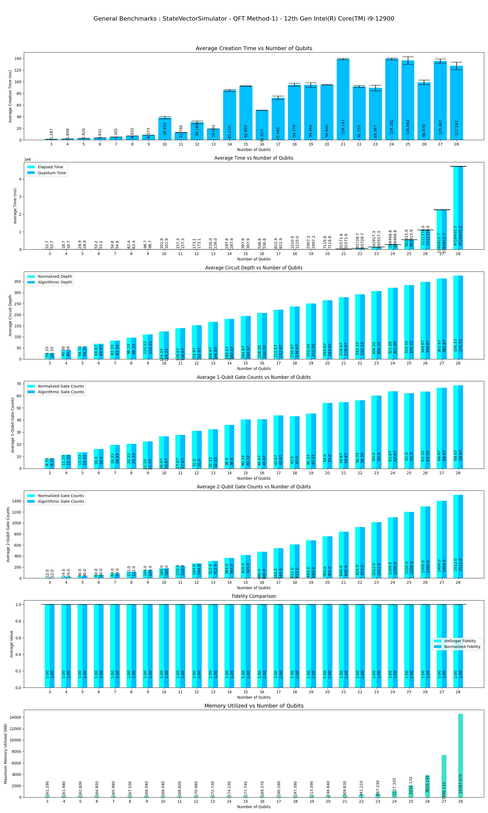
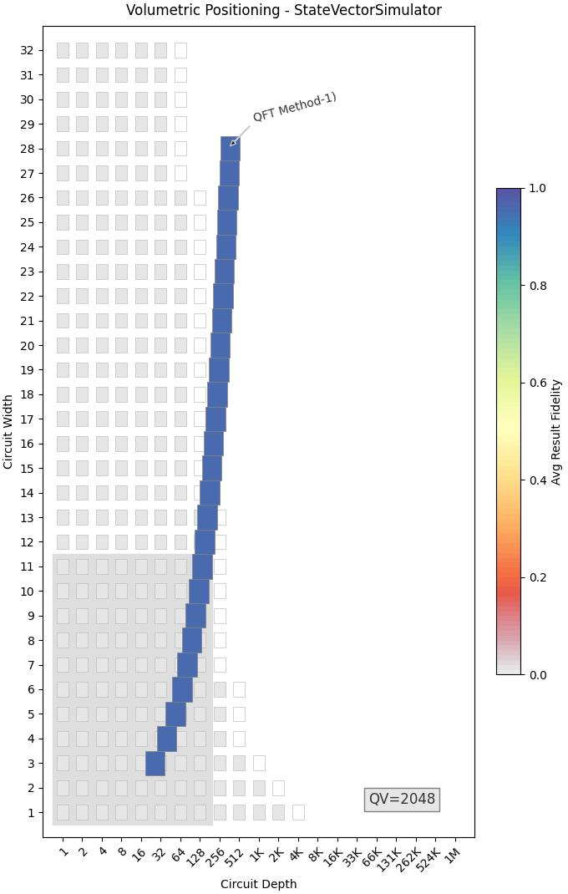
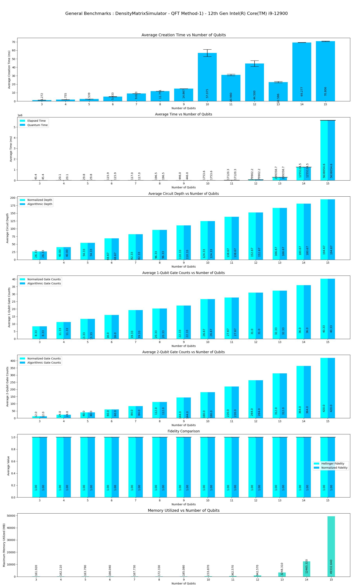
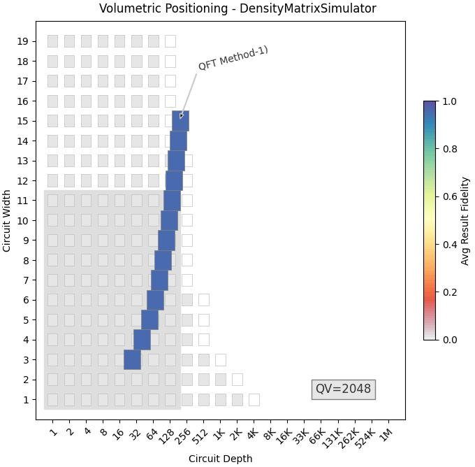
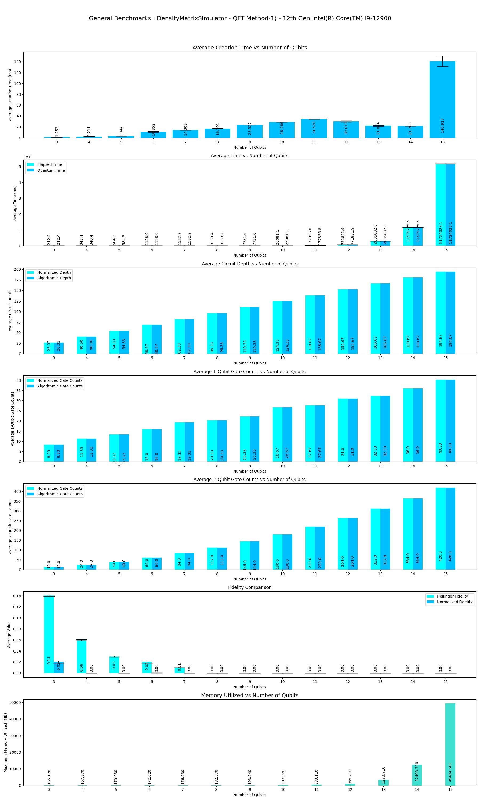
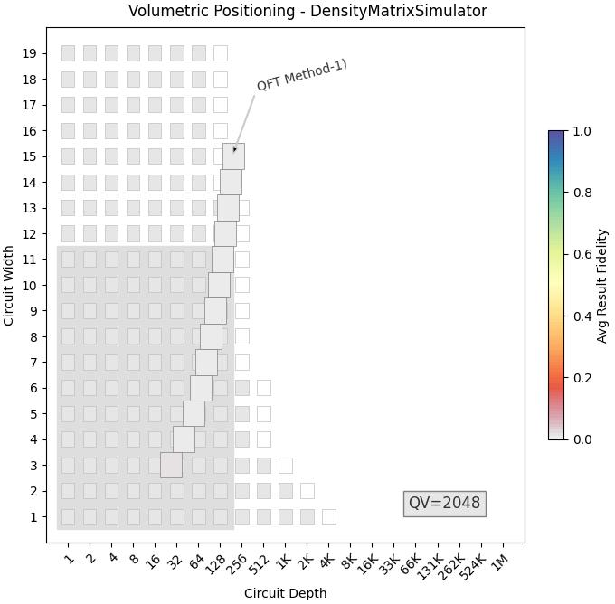

This program performs Benchmarks of **Quantum Fourier Transform** Algorithm on Braket's simulators.

|Platform|Parameters|Noise Parameters|Benchmarks|Volumetric Positioning|Remarks|
|--------|----------|----------------|----------|----------------------|-------|
|LocalSimulator(Statevector)|min_qubits=3, max_qubits=28, skip_qubits=1, max_circuits=3, num_shots=1000, method=1|***ideal***|||Execution terminated after **28** Qubits due to lack of memory.|
|LocalSimulator(dm_simulator)|min_qubits=3, max_qubits=15, skip_qubits=1, max_circuits=3, num_shots=1000, method=1|***ideal***|||Execution terminated after **15** Qubits due to lack of memory.|
|LocalSimulator(dm_simulator)|min_qubits=3, max_qubits=15, skip_qubits=1, max_circuits=3, num_shots=1000, method=1|noises.BitFlip(probability=0.01), noises.PhaseFlip(probability=0.1), noises.Depolarizing(probability=0.1), noises.TwoQubitDepolarizing(probability=0.1), noises.TwoQubitDephasing(probability=0.1), noises.AmplitudeDamping(gamma=0.1),noises.GeneralizedAmplitudeDamping(gamma=0.1, probability=0.1), noises.PhaseDamping(gamma=0.1), noises.PauliChannel(probX=0.1, probY=0.2, probZ=0.3)|||Execution terminated after **15** Qubits due to lack of memory.|
