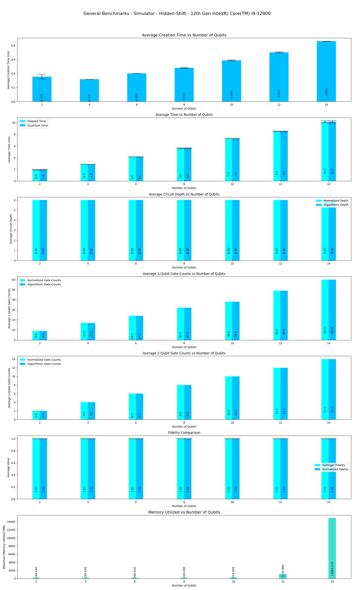
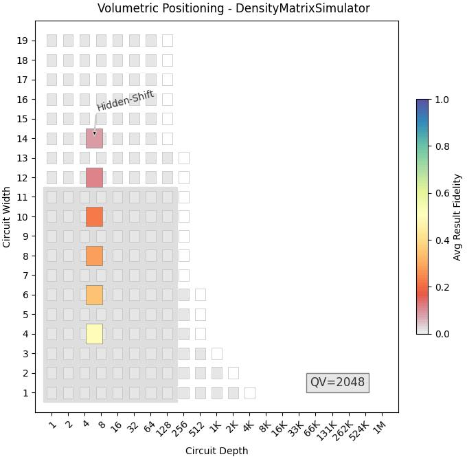

This program performs Benchmarks of **Hidden-Shift** Algorithm on various Local Simulators provided by **CIRQ**.

|Platform|Parameters|Noise Parameters|Benchmarks|Volumetric Positioning|Remarks|
|--------|----------|----------------|----------|----------------------|-------|
|simulator |min_qubits=2, max_qubits=14, skip_qubits=2, max_circuits=2, num_shots=1000, basis: "CZTarget"|***ideal***|||Because of memory limitation execution is terminated only upto **15** Qubits.|
|simulator |min_qubits=2, max_qubits=14, skip_qubits=2, max_circuits=2, num_shots=1000, basis: "CZTarget"|cirq.depolarize(p=0.01), cirq.bit_flip(p=0.01), cirq.phase_flip(p=0.01), cirq.amplitude_damp(gamma=0.01)|||Because of memory limitation execution is terminated only upto **15** Qubits.|
|DensityMatrixSimulator |min_qubits=4, max_qubits=14, skip_qubits=2, max_circuits=2, num_shots=1000, basis: "CZTarget"|***ideal***|||Because of memory limitation execution is terminated only upto **15** Qubits.|
|DensityMatrixSimulator|min_qubits=4, max_qubits=14, skip_qubits=2, max_circuits=2, num_shots=1000, basis: "CZTarget"|cirq.depolarize(p=0.01), cirq.bit_flip(p=0.01), cirq.phase_flip(p=0.01), cirq.amplitude_damp(gamma=0.01)|||Because of memory limitation execution is terminated only upto **14** Qubits.|
|CliffordSimulator |min_qubits=4, max_qubits=14, skip_qubits=2, max_circuits=2, num_shots=1000, basis: "CZTarget"|***ideal***|||Because of memory limitation execution is terminated only upto **14** Qubits.|
|simulator |min_qubits=2, max_qubits=14, skip_qubits=2, max_circuits=2, num_shots=1000, basis: "SqrtIswapTarget"|***ideal***|||Because of memory limitation execution is terminated only upto **14** Qubits.|
|simulator |min_qubits=2, max_qubits=14, skip_qubits=2, max_circuits=2, num_shots=1000, basis: "SqrtIswapTarget"|cirq.depolarize(p=0.01), cirq.bit_flip(p=0.01), cirq.phase_flip(p=0.01), cirq.amplitude_damp(gamma=0.01)|||Because of memory limitation execution is terminated only upto **14** Qubits.|
|DensityMatrixSimulator |min_qubits=2, max_qubits=14, skip_qubits=2, max_circuits=2, num_shots=1000, basis: "SqrtIswapTarget"|***ideal***|||Because of memory limitation execution is terminated only upto **14** Qubits.|