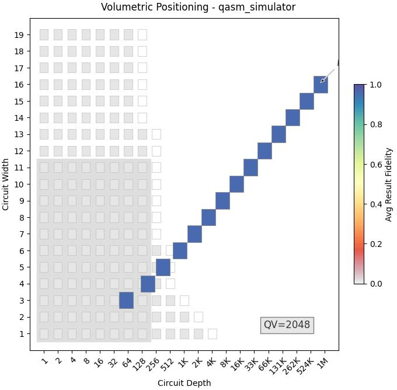
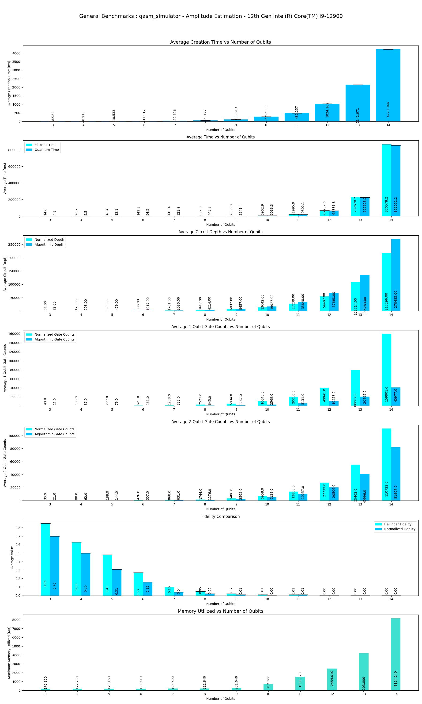
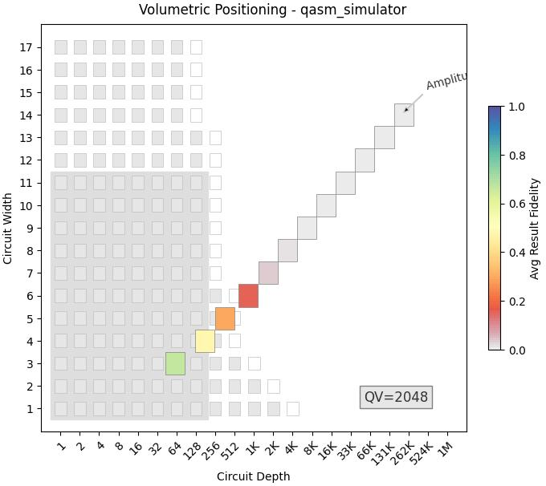
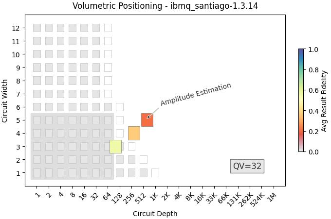
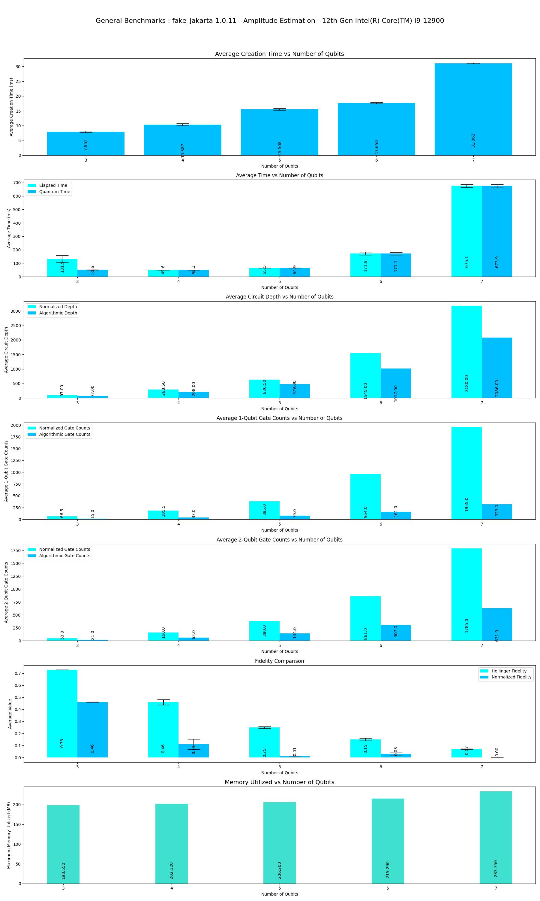
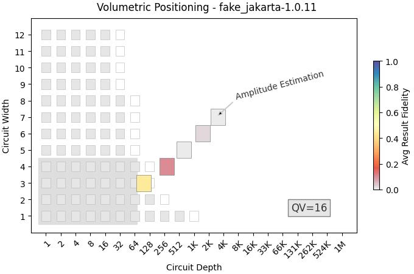
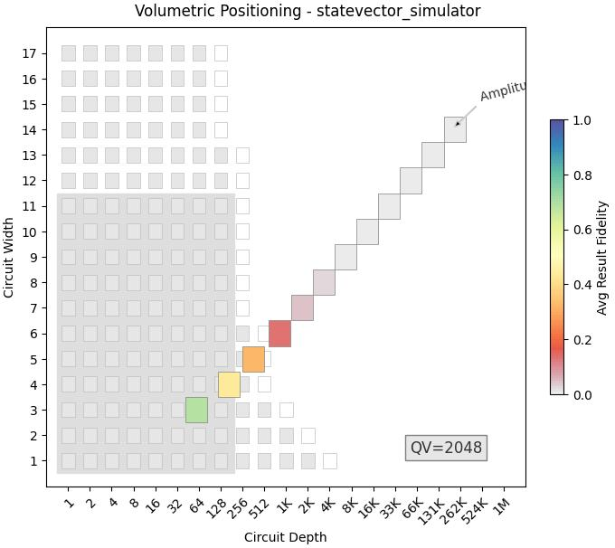
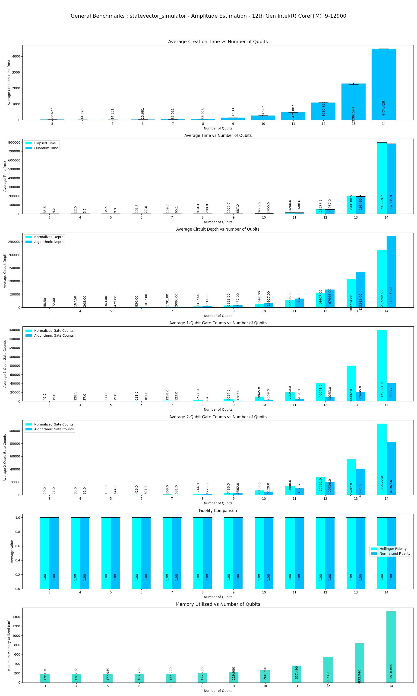
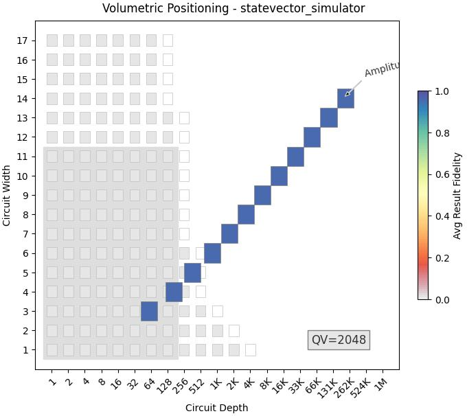

This program performs Benchmarks of **Amplitude Estimation** Algorithm on various simulators provided by **Aer** provider and also includes benchmarks performed with **FakeProviders**.

|Platform|Parameters|Noise Parameters|Benchmarks|Volumetric Positioning|Remarks|
|--------|----------|----------------|----------|----------------------|-------|
|qasm_simulator (0.13.3)|min_qubits=3, max_qubits=16, skip_qubits=1, max_circuits=2, num_shots=1000, basis: 1-['rx', 'ry', 'rz', 'cx']|***ideal***|||Qasm simulator supports upto **31** qubits. min_qubits is considered as **3** by default if given **less than 3**. It takes more execution time after after **16** Qubits.|
|qasm_simulator (0.13.3)|min_qubits=3, max_qubits=14, skip_qubits=1, max_circuits=2, num_shots=1000,basis: 1-['rx', 'ry', 'rz', 'cx']|depol_one_qb_error = 0.005, depol_two_qb_error = 0.005, reset_to_zero_error = 0.005, reset_to_one_error = 0.005|||Longer execution period after **14** Qubits.|
|ibmq_santiago (1.3.14) **FAKE**|min_qubits=3, max_qubits=5(default), skip_qubits=1, max_circuits=2, num_shots=1000, basis: (default-Provider)|***Provider Preset***|||This is Fake Backend with maximum supported qubits **5**.|
|FakeJakartaV2 (1.0.11) **FAKEV2**|min_qubits=3, max_qubits=7(default), skip_qubits=1, max_circuits=2, num_shots=1000 ,basis: (default-Provider)|***Provider Preset***|||This is Fake Backend *(version-2)* with maximum supported qubits **7**|
|statevector_simulator |min_qubits=3, max_qubits=14, skip_qubits=1, max_circuits=2, num_shots=1000,basis: 1-['rx', 'ry', 'rz', 'cx']|depol_one_qb_error = 0.005, depol_two_qb_error = 0.005, reset_to_zero_error = 0.005, reset_to_one_error = 0.005|||Statevector simulator supports upto **31** qubits. To avoid longer execution periods it is limited to **14** Qubits.|
|statevector_simulator |min_qubits=3, max_qubits=14, skip_qubits=1, max_circuits=2, num_shots=1000,basis: 1-['rx', 'ry', 'rz', 'cx']|***ideal***|||To avoid longer execution periods it is limited to **14** Qubits.|