This program performs Benchmarks of **Bernstein-Vazirani** Algorithm on various simulators provided by **Aer** provider and also includes benchmarks performed with **FakeProviders**.

|Platform|Parameters|Noise Parameters|Benchmarks|Volumetric Positioning|Remarks|
|--------|----------|----------------|----------|----------------------|-------|
|qasm_simulator |min_qubits=3, max_qubits=31, skip_qubits=1, max_circuits=2, num_shots=1000, method=1, input_value=None (default),basis: 1-['rx', 'ry', 'rz', 'cx']|***ideal***||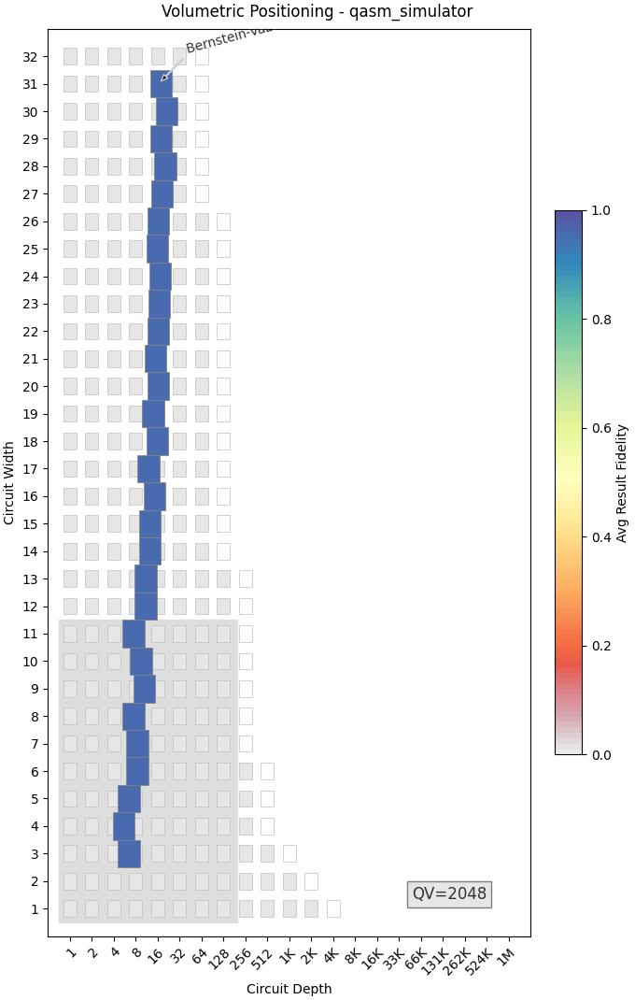|Qasm simulator only supports upto **31** qubits.|
|qasm_simulator |min_qubits=3, max_qubits=31, skip_qubits=1, max_circuits=2, num_shots=1000, method=1, input_value=None (default),basis: 1-['rx', 'ry', 'rz', 'cx']|depol_one_qb_error = 0.005, depol_two_qb_error = 0.005, reset_to_zero_error = 0.005, reset_to_one_error = 0.005||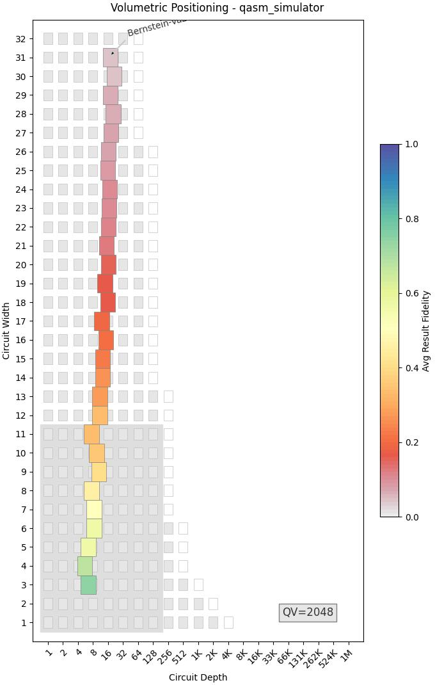|Qasm simulator only supports upto **31** qubits.|
|fake_athens (1.3.13) **FAKE**|min_qubits=3, max_qubits=5(default), skip_qubits=1, max_circuits=2, num_shots=1000, method=1, input_value=None(default) ,basis: (default-Provider)|***Provider Preset***|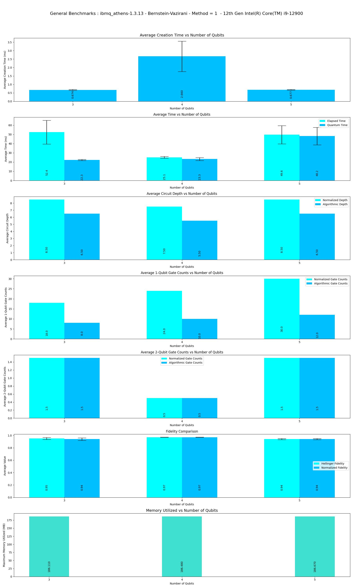|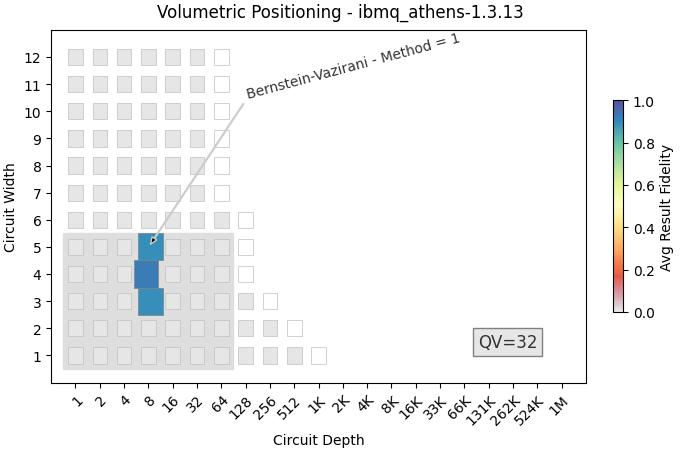|This is Fake Backend with maximum supported qubits **5**|
|fake_athens (1.3.13) **FAKE**|min_qubits=3, max_qubits=5(default), skip_qubits=1, max_circuits=2, num_shots=1000, method=1, input_value=5(default) ,basis: (default-Provider)|***Provider Preset***|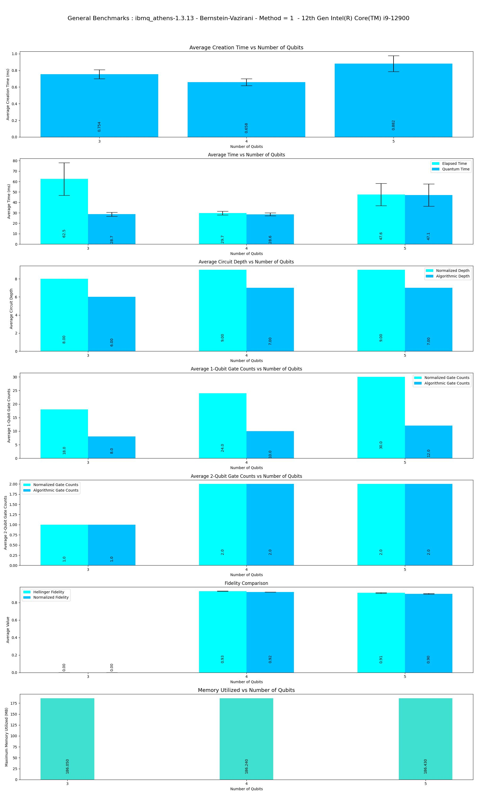|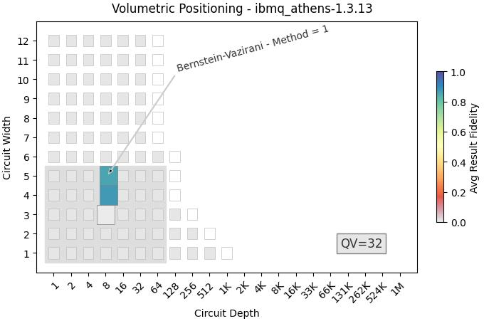|This is Fake Backend with maximum supported qubits **5**|
|fake_Jakarta (1.0.11) **FAKEV2**|min_qubits=3, max_qubits=7(default), skip_qubits=1, max_circuits=2, num_shots=1000, method=1, input_value=5 ,basis: (default-Provider)|***Provider Preset***|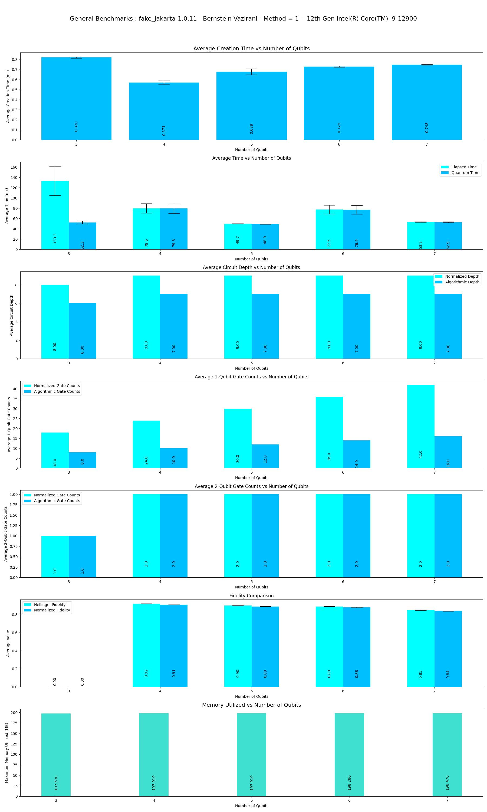|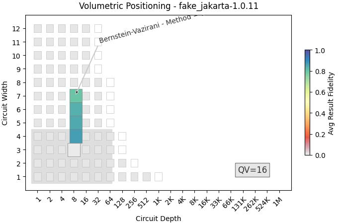|This is Fake Backend *(version-2)* with maximum supported qubits **7**. As i have given input_value=5 (i.e.,101) can only represented in 3 bits of input but here at 3-Qubits ckt only 2 Qubits are used for inputs so the fidelity is 0.|
|Statevector_simulator |min_qubits=3, max_qubits=26, skip_qubits=1, max_circuits=2, num_shots=1000, method=1, input_value=None (default),basis: 1-['rx', 'ry', 'rz', 'cx']|***ideal***|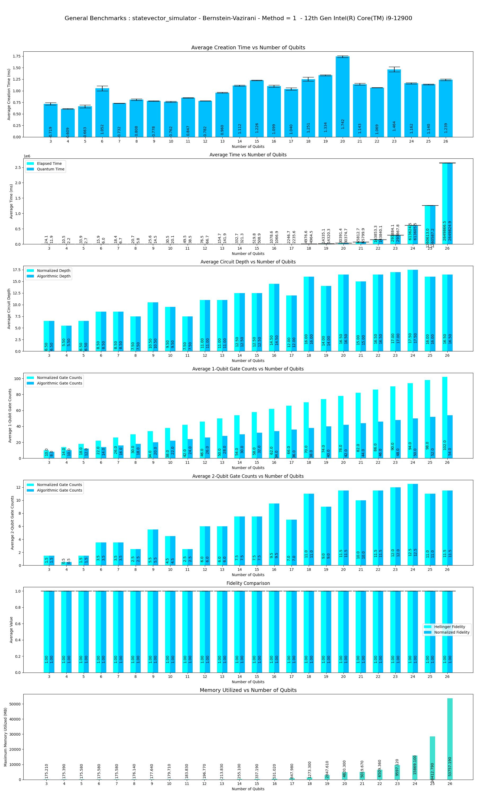|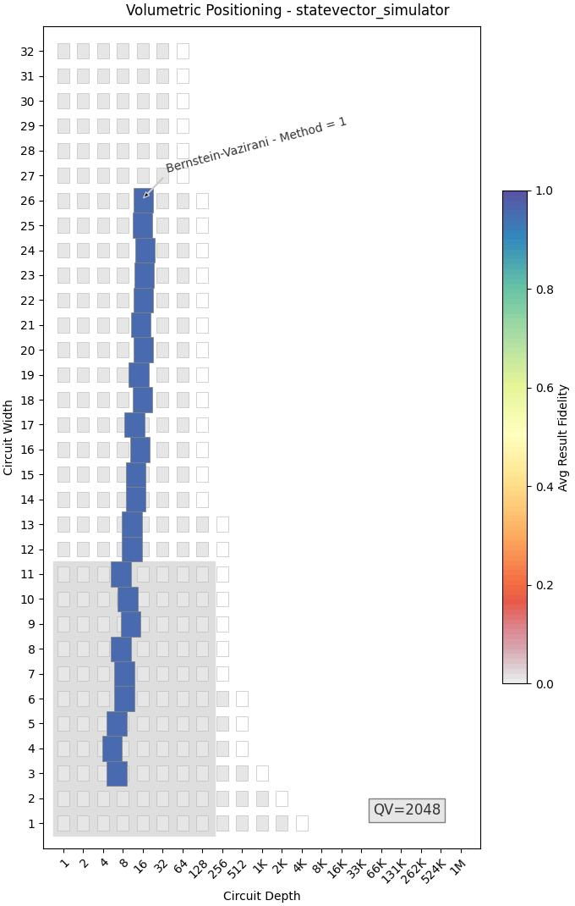|Statevector simulator only supports upto **31** qubits. Kernel died at **27** Qubits due to insufficent memory.|
|Statevector_simulator |min_qubits=3, max_qubits=26, skip_qubits=1, max_circuits=2, num_shots=1000, method=1, input_value=None (default),basis: 1-['rx', 'ry', 'rz', 'cx']|depol_one_qb_error = 0.005, depol_two_qb_error = 0.005, reset_to_zero_error = 0.005, reset_to_one_error = 0.005|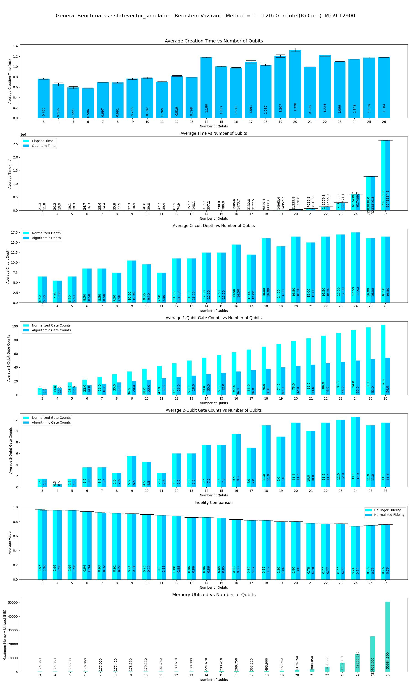|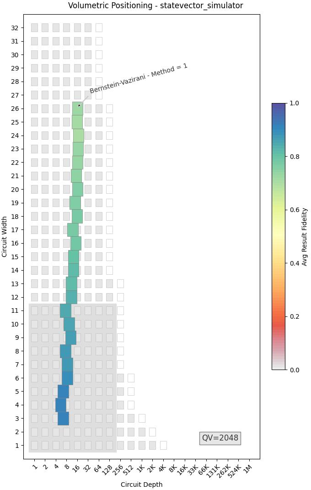| Kernel died at **27** Qubits due to insufficient memory.|
|qasm_simulator (0.13.3)|min_qubits=3, max_qubits=31, skip_qubits=1, max_circuits=2, num_shots=1000, method=2, num_resets=2, input_value=None (default),basis: 1-['rx', 'ry', 'rz', 'cx']|***ideal***|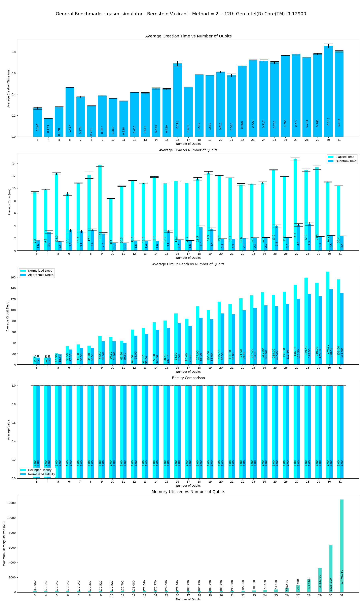||Qasm simulator only supports upto **31** qubits.|
|qasm_simulator |min_qubits=3, max_qubits=31, skip_qubits=1, max_circuits=2, num_shots=1000, method=2, num_resets=2, input_value=None (default),basis: 1-['rx', 'ry', 'rz', 'cx']|depol_one_qb_error = 0.005, depol_two_qb_error = 0.005, reset_to_zero_error = 0.005, reset_to_one_error = 0.005|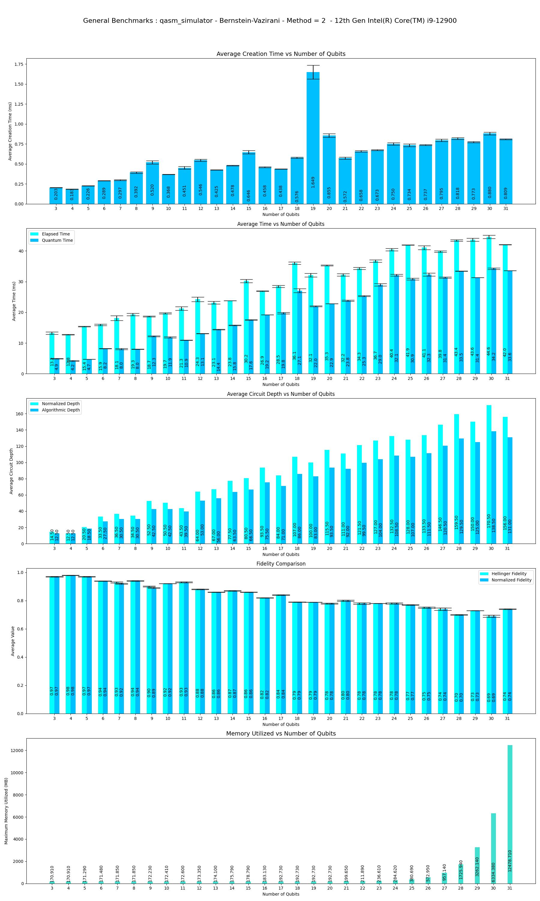||Qasm simulator only supports upto **31** qubits.|
|fake_santiago (1.3.14) **FAKE**|min_qubits=3, max_qubits=5(default), skip_qubits=1, max_circuits=2, num_shots=1000, method=2,num_resets=2, input_value=None(default) ,basis: (default-Provider)|***Provider Preset***|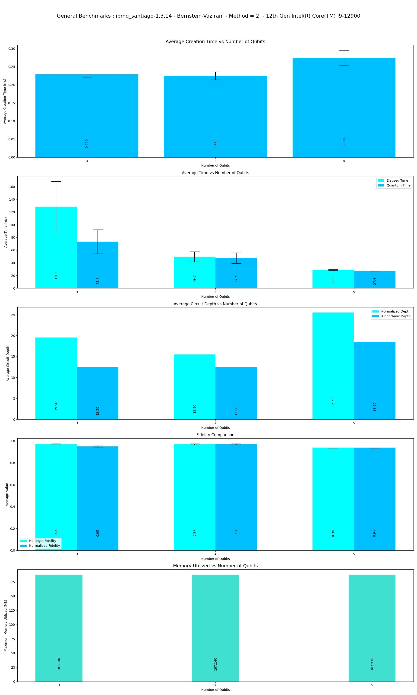|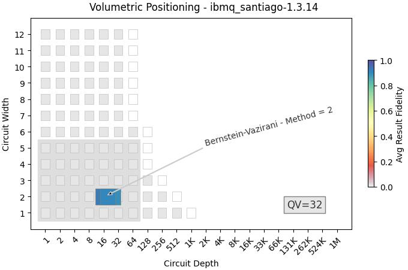|This is Fake Backend with maximum supported qubits **5**|
|Statevector_simulator (0.13.3)|min_qubits=3, max_qubits=31, skip_qubits=1, max_circuits=2, num_shots=1000, method=2, num_resets=2, input_value=None (default),basis: 1-['rx', 'ry', 'rz', 'cx']|depol_one_qb_error = 0.005, depol_two_qb_error = 0.005, reset_to_zero_error = 0.005, reset_to_one_error = 0.005|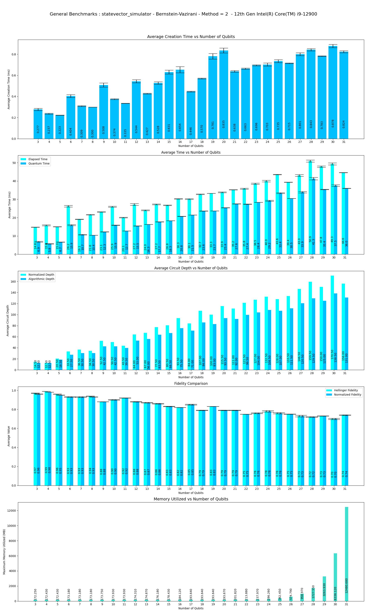|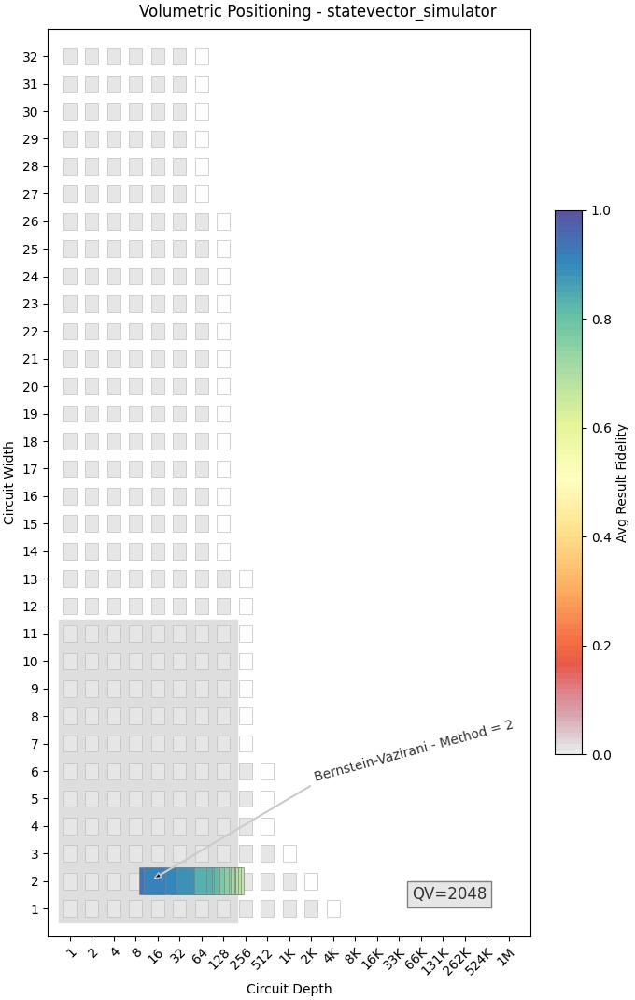|Statevector simulator only supports upto **31** qubits.|
|Statevector_simulator (0.13.3)|min_qubits=3, max_qubits=31, skip_qubits=1, max_circuits=2, num_shots=1000, method=2, num_resets=2, input_value=None (default),basis: 1-['rx', 'ry', 'rz', 'cx']|***ideal***|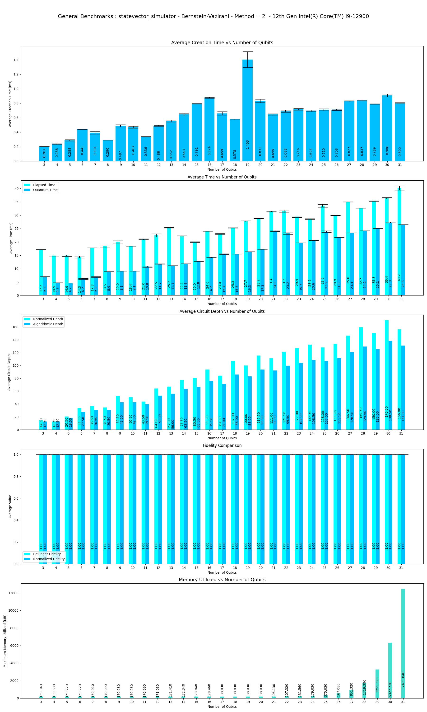|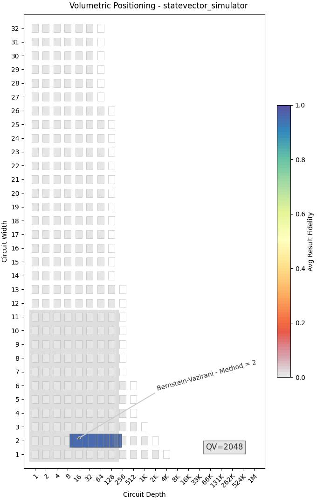|Statevector simulator only supports upto **31** qubits.|