This program performs Benchmarks of **Grover's Search** Algorithm on various simulators provided by **Aer** provider and also includes benchmarks performed with **FakeProviders**.

|Platform|Parameters|Noise Parameters|Benchmarks|Volumetric Positioning|Remarks|
|--------|----------|----------------|----------|----------------------|-------|
|qasm_simulator |min_qubits=3, max_qubits=13, skip_qubits=1, max_circuits=2, num_shots=1000, basis: 1-['rx', 'ry', 'rz', 'cx']|***ideal***|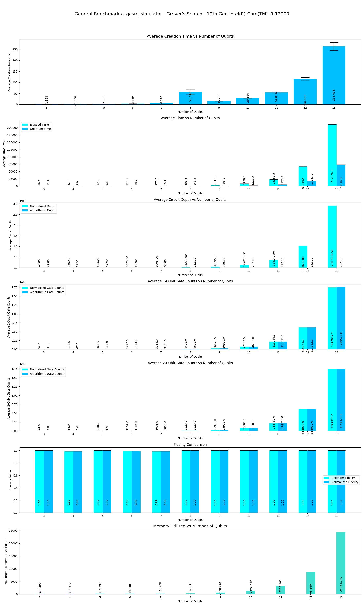|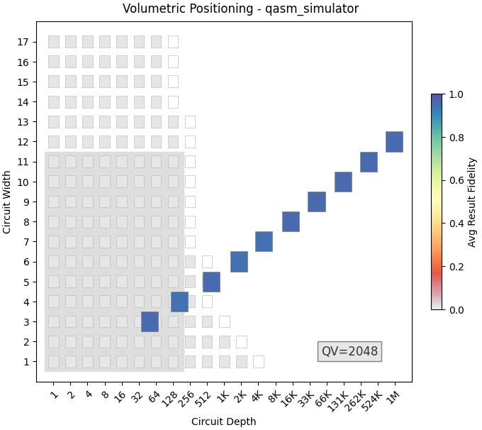|Qasm simulator supports upto **31** qubits. But from **14** qubits execution time and memory constriants increase drastically.|
|qasm_simulator |min_qubits=3, max_qubits=12, skip_qubits=1, max_circuits=2, num_shots=1000,basis: 1-['rx', 'ry', 'rz', 'cx']|depol_one_qb_error = 0.05, depol_two_qb_error = 0.005, reset_to_zero_error = 0.005, reset_to_one_error = 0.005|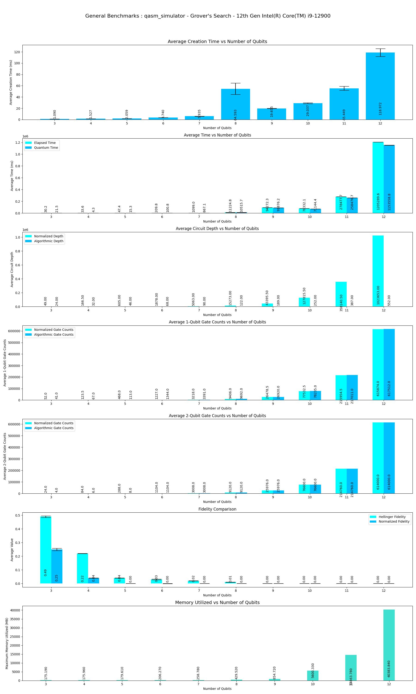|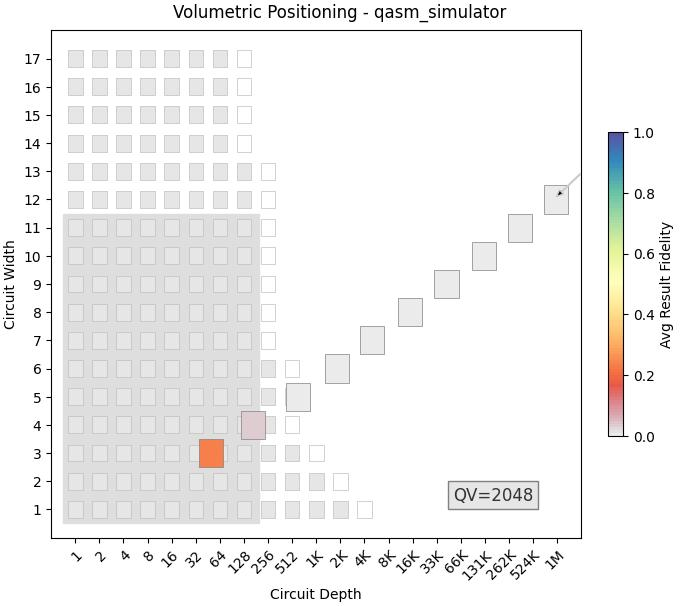|Qasm simulator supports upto **31** qubits. Kernel getting died at 13 Qubits due to insufficent memory.|
|FakeSantiago (1.3.13) **FAKE**|min_qubits=3, max_qubits=5(default), skip_qubits=1, max_circuits=2, num_shots=1000, basis: (default-Provider)|***Provider Preset***|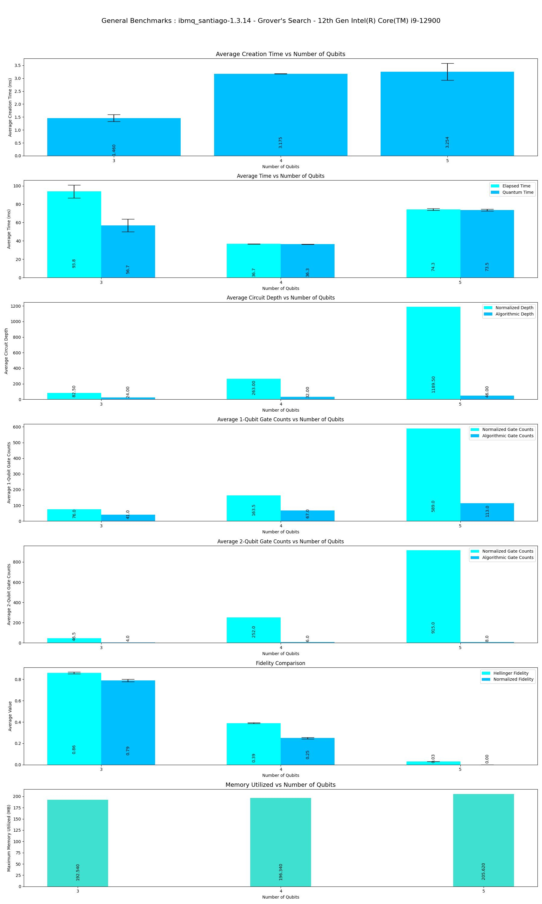|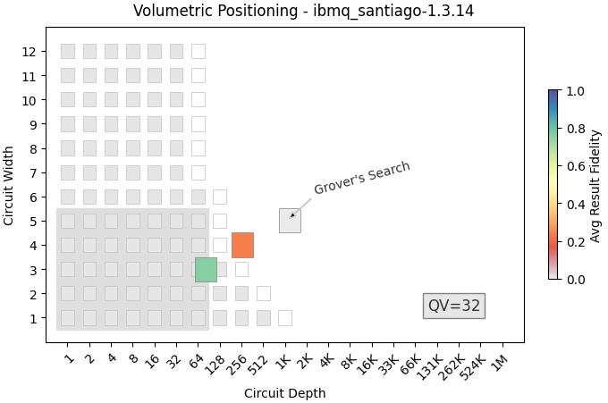|This is Fake Backend with maximum supported qubits **5**.|
|FakeJakartaV2 (1.0.11) **FAKEV2**|min_qubits=3, max_qubits=7(default), skip_qubits=1, max_circuits=2, num_shots=1000 ,basis: (default-Provider)|***Provider Preset***|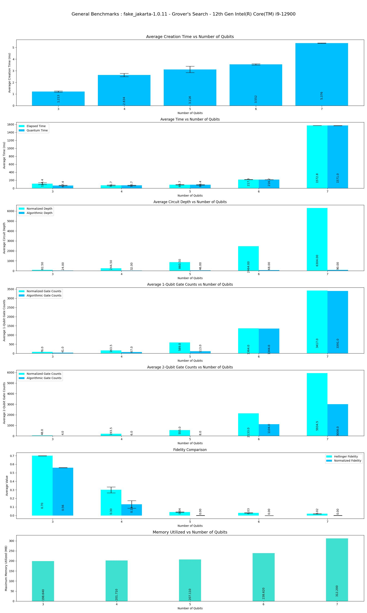|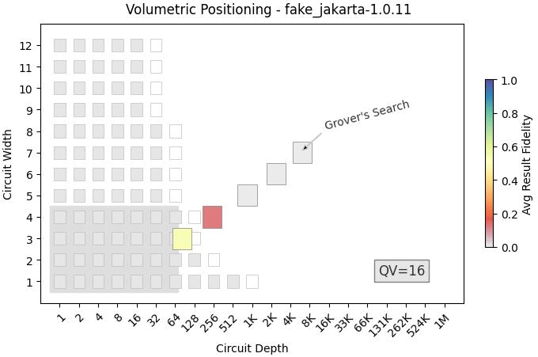|This is Fake Backend *(version-2)* with maximum supported qubits **7**|
|statevector_simulator |min_qubits=3, max_qubits=13, skip_qubits=1, max_circuits=2, num_shots=1000,basis: 1-['rx', 'ry', 'rz', 'cx']|***ideal***|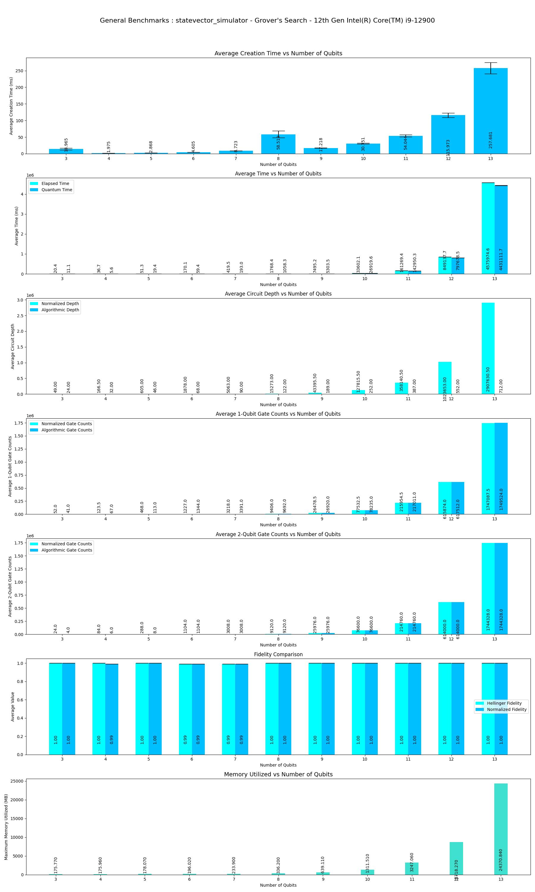|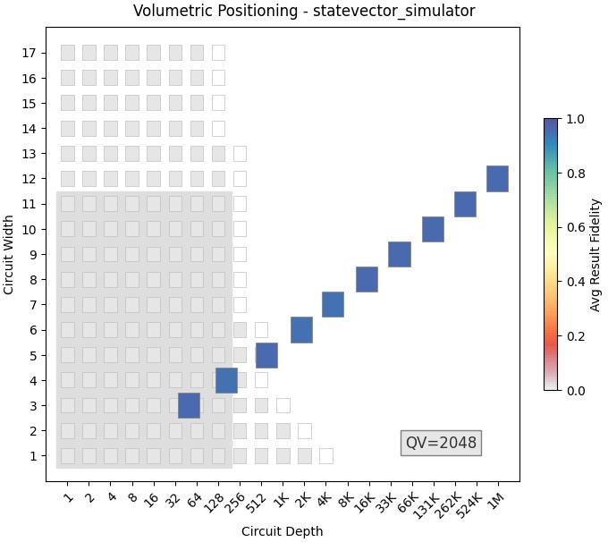|At 14 Qubits, Kernel is getting killed due to insufficient memory.|
|statevector_simulator |min_qubits=3, max_qubits=14, skip_qubits=1, max_circuits=2, num_shots=1000,basis: 1-['rx', 'ry', 'rz', 'cx']|depol_one_qb_error = 0.05, depol_two_qb_error = 0.005, reset_to_zero_error = 0.005, reset_to_one_error = 0.005|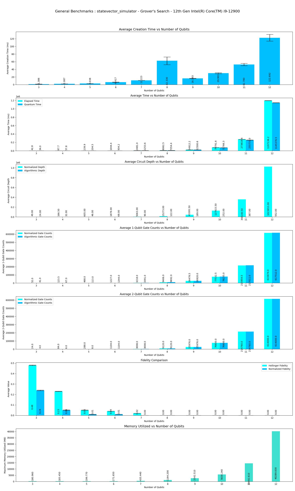|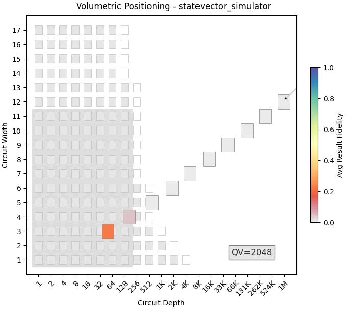|Kernel getting killed at **13** Qubits due to insufficent memory.|