This program performs Benchmarks of **Phase Estimation** Algorithm on various simulators provided by **Aer** provider and also includes benchmarks performed with **FakeProviders**.

|Platform|Parameters|Noise Parameters|Benchmarks|Volumetric Positioning|Remarks|
|--------|----------|----------------|----------|----------------------|-------|
|qasm_simulator |min_qubits=3, max_qubits=29, max_circuits=2, num_shots=1000, basis: 1-['rx', 'ry', 'rz', 'cx']|***ideal***|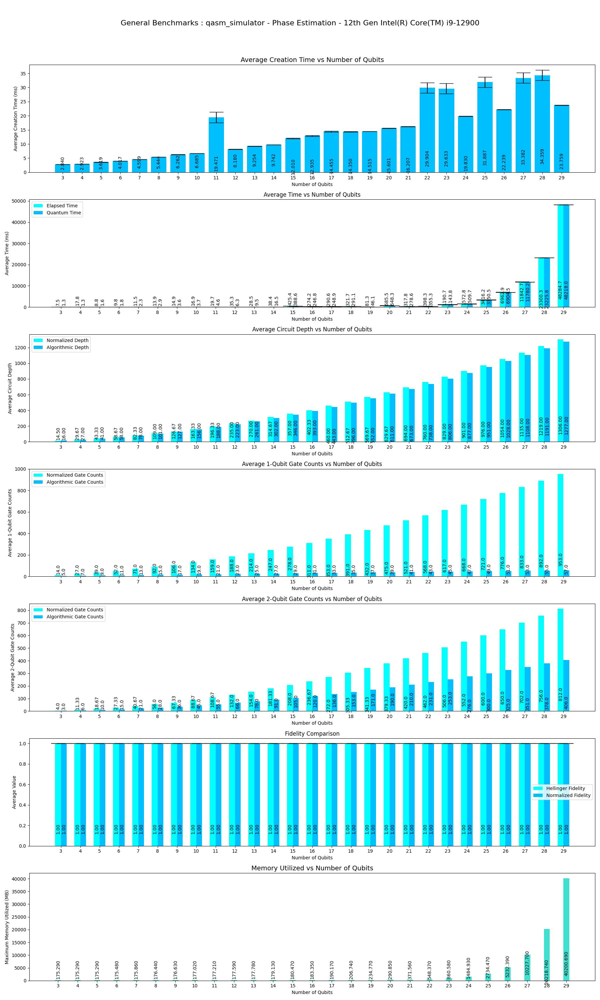|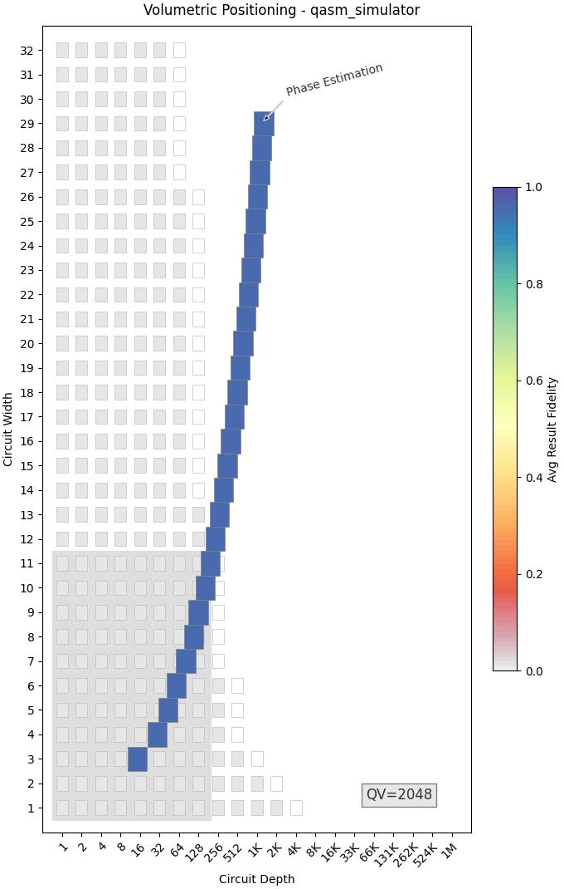|Qasm simulator supports upto **31** qubits. Execution is terminated upto **29** qubits because of time and memory constraints. |
|qasm_simulator |min_qubits=3, max_qubits=28, max_circuits=2, num_shots=1000,basis: 1-['rx', 'ry', 'rz', 'cx']|depol_one_qb_error = 0.05, depol_two_qb_error = 0.005, reset_to_zero_error = 0.005, reset_to_one_error = 0.005|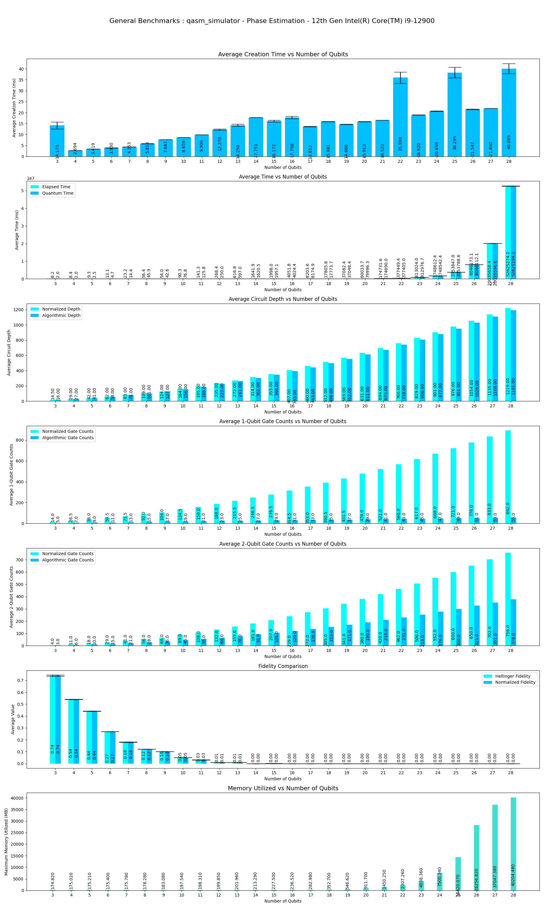|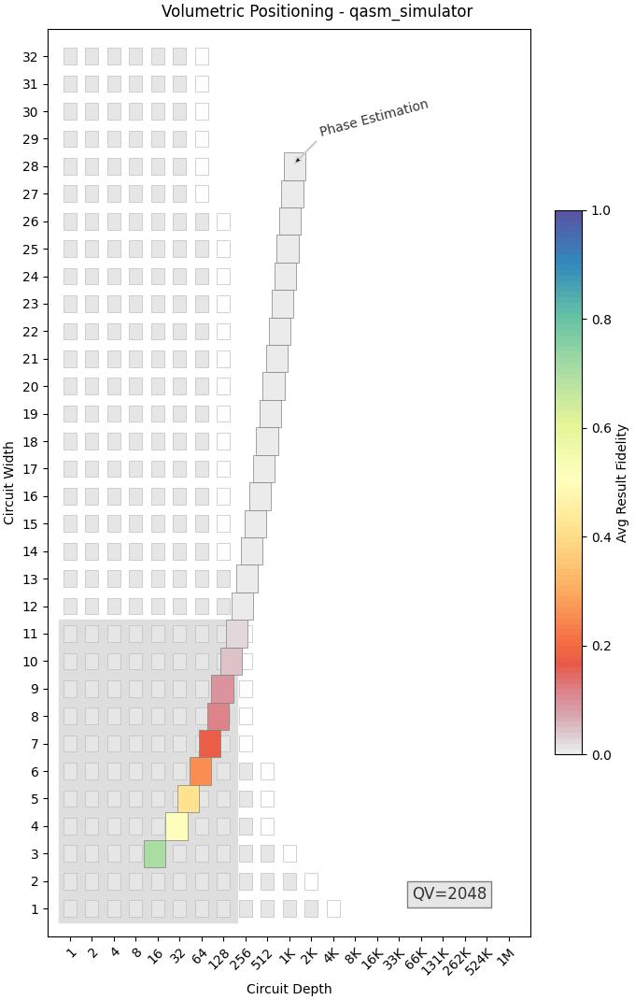|Execution is terminated at **28** Qubits because of longer execution periods and memory constriants.|
|fake_guadalupe (1.2.15)|min_qubits=3, max_qubits=16, skip_qubits=1, max_circuits=2, num_shots=1000,basis: (default-Provider)|***Provider's Preset***|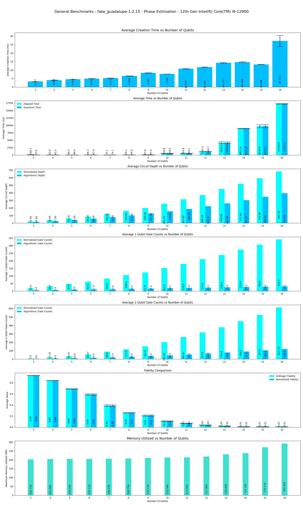|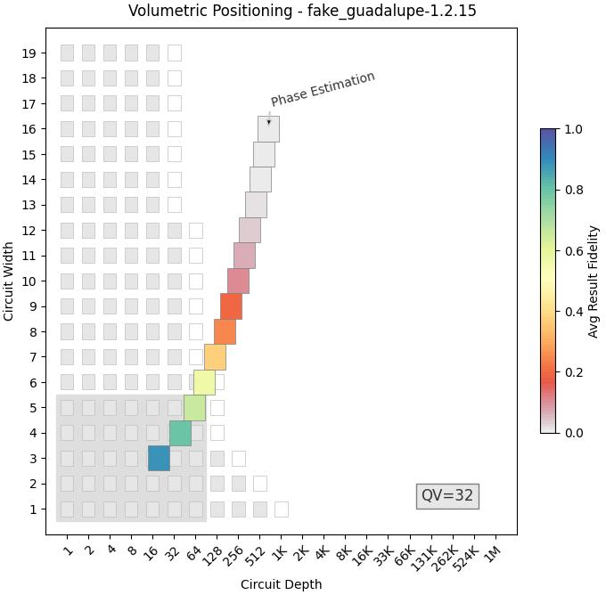|Execution is terminated at **16** Qubits as fake backend supports only upto that.|
|ibmq_santiago (1.3.14)|min_qubits=3, max_qubits=5, skip_qubits=1, max_circuits=2, num_shots=1000,basis: (default-Provider)|***Provider's Preset***|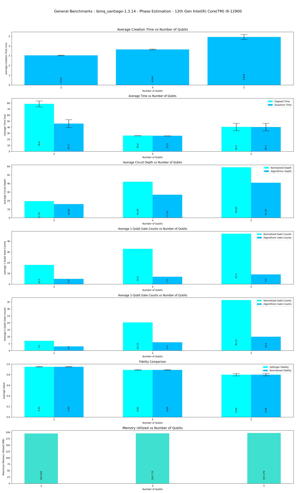|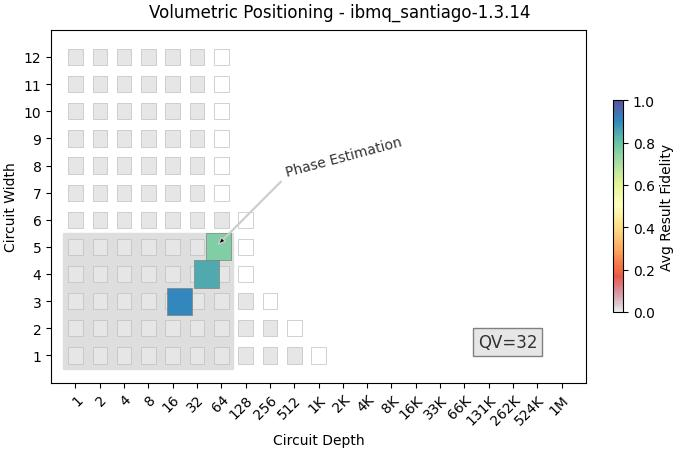|Execution is terminated at **5** Qubits because of limitation in backend implementation.|
|statevector_simulator|min_qubits=3, max_qubits=26, skip_qubits=1, max_circuits=2, num_shots=1000,basis: 1-['rx', 'ry', 'rz', 'cx']|***ideal***|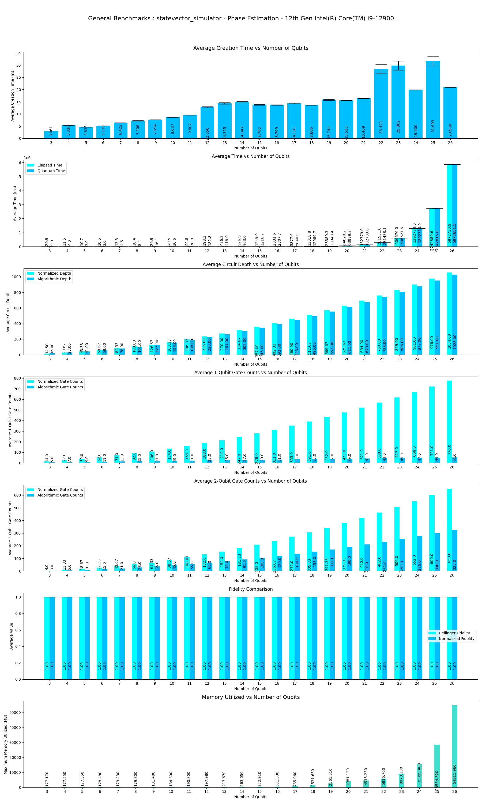|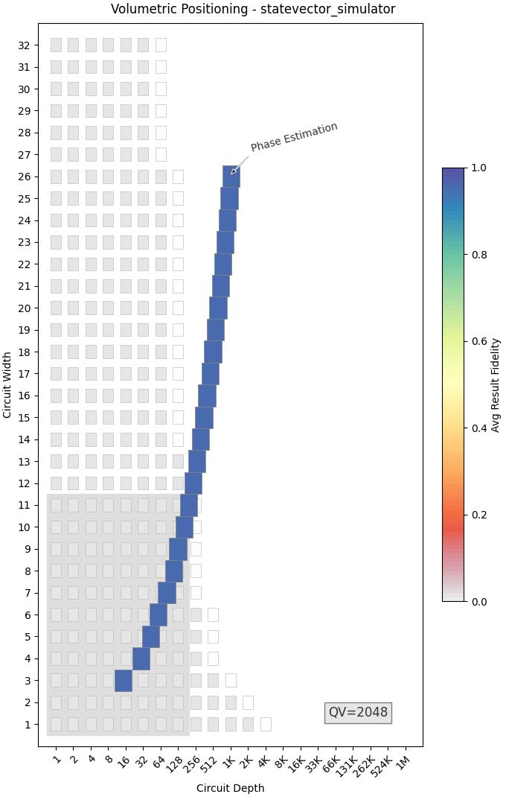|Execution is terminated at **26** Qubits because of memory constriants.|
|statevector_simulator |min_qubits=3, max_qubits=25, skip_qubits=1, max_circuits=2, num_shots=1000,basis: 1-['rx', 'ry', 'rz', 'cx']|depol_one_qb_error = 0.05, depol_two_qb_error = 0.005, reset_to_zero_error = 0.005, reset_to_one_error = 0.005|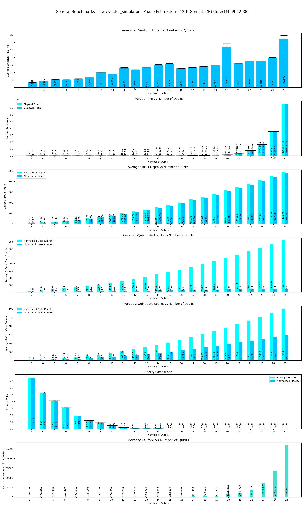|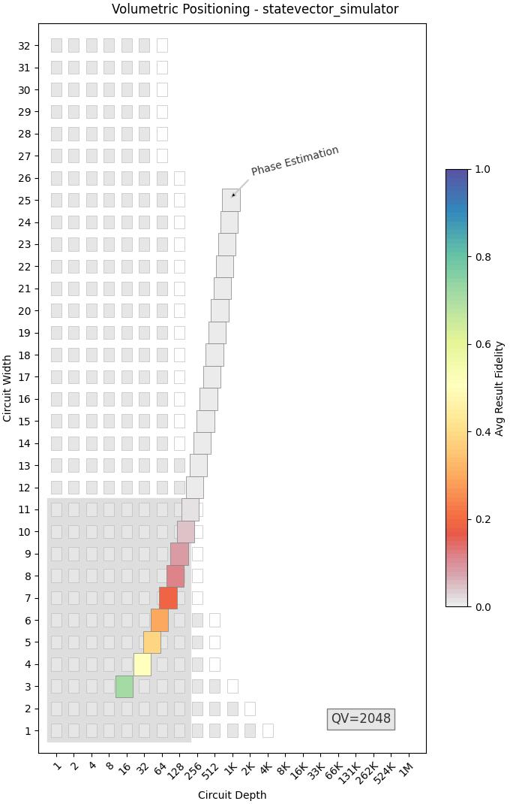|Execution is terminated at **25** Qubits because of memory constraints.|
