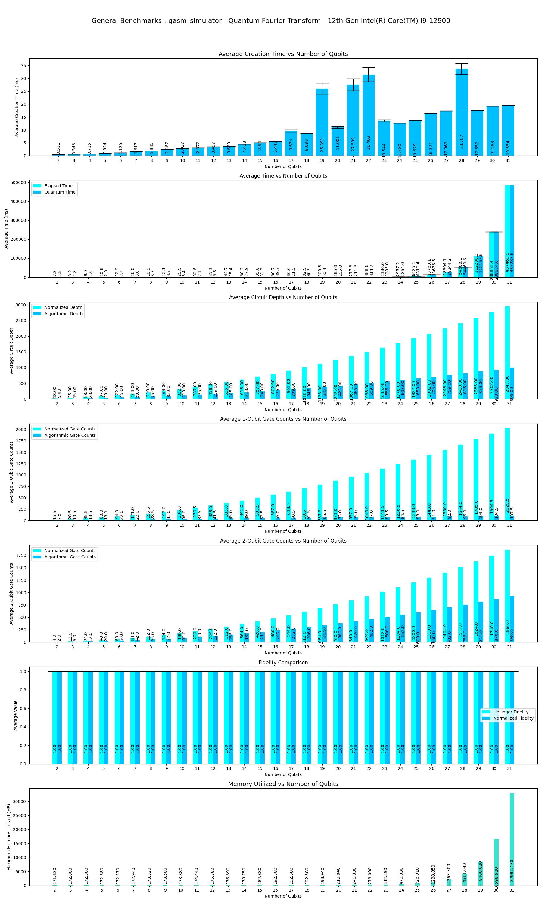

This program performs Benchmarks of **Quantum Fourier Transform** Algorithm on various simulators provided by **Aer** provider and also includes benchmarks performed with **FakeProviders**.

|Platform|Parameters|Noise Parameters|Benchmarks|Volumetric Positioning|Remarks|
|--------|----------|----------------|----------|----------------------|-------|
|qasm_simulator **Method-1** |min_qubits=2, max_qubits=31, skip_qubits=1, max_circuits=2, num_shots=1000, basis: 1-['rx', 'ry', 'rz', 'cx']|***ideal***|||Qasm simulator only supports upto **31** qubits.|
|qasm_simulator **Method-1** |min_qubits=2, max_qubits=25, skip_qubits=1, max_circuits=2, num_shots=1000,basis: 1-['rx', 'ry', 'rz', 'cx']|depol_one_qb_error = 0.005, depol_two_qb_error = 0.005, reset_to_zero_error = 0.005, reset_to_one_error = 0.005|||Execution performed only upto **25** qubits, due to memory and timing constriants.|
|statevector_simulator **Method-1** |min_qubits=2, max_qubits=25, skip_qubits=1, max_circuits=2, num_shots=1000,basis: 1-['rx', 'ry', 'rz', 'cx']|depol_one_qb_error = 0.005, depol_two_qb_error = 0.005, reset_to_zero_error = 0.005, reset_to_one_error = 0.005|||Execution performed only upto **25** qubits, due to memory and timing constriants.|
|statevector_simulator **Method-1** |min_qubits=2, max_qubits=26, skip_qubits=1, max_circuits=2, num_shots=1000, basis: 1-['rx', 'ry', 'rz', 'cx']|***ideal***|||Execution is limited to **26** qubits due to memory constriants.|
|FakeSantiago (1.3.14) **Method-1**| min_qubits=2, max_qubits= 5, skip_qubits=1, max_circuits=2, num_shots=1000, basis: 1-['rx','ry','rz','cx']|***Fake backend Provider preset***|||This fake backend only supports upto **5** qubits.|
|FakeJakartaV2 (1.0.11) **Method-1**| min_qubits=2, max_qubits= 7, skip_qubits=1, max_circuits=2, num_shots=1000, basis: 1-['rx','ry','rz','cx']|***Fake backend V2 Provider preset***|||This fake backend only supports upto **7** qubits.|
|FakeJakartaV2 (1.0.11) **Method-2**| min_qubits=2, max_qubits= 7, skip_qubits=1, max_circuits=2, num_shots=1000, basis: 1-['rx','ry','rz','cx']|***Fake backend V2 Provider preset***|||This fake backend only supports upto **7** qubits.|
|FakeJakartaV2 (1.0.11) **Method-3**| min_qubits=2, max_qubits= 7, skip_qubits=1, max_circuits=2, num_shots=1000, basis: 1-['rx','ry','rz','cx']|***Fake backend V2 Provider preset***|||This fake backend only supports upto **7** qubits.|
|FakeSantiago (1.3.14) **Method-2**| min_qubits=2, max_qubits= 5, skip_qubits=1, max_circuits=2, num_shots=1000, basis: 1-['rx','ry','rz','cx']|***Fake backend Provider preset***|||This fake backend only supports upto **5** qubits.|
|FakeSantiago (1.3.14) **Method-3**| min_qubits=2, max_qubits= 5, skip_qubits=1, max_circuits=2, num_shots=1000, basis: 1-['rx','ry','rz','cx']|***Fake backend Provider preset***|||This fake backend only supports upto **5** qubits.|
|qasm_simulator **Method-2** |min_qubits=2, max_qubits=31, skip_qubits=1, max_circuits=2, num_shots=1000, basis: 1-['rx', 'ry', 'rz', 'cx']|***ideal***|||Qasm simulator only supports upto **31** qubits.|
|qasm_simulator **Method-3** |min_qubits=2, max_qubits=31, skip_qubits=1, max_circuits=2, num_shots=1000, basis: 1-['rx', 'ry', 'rz', 'cx']|***ideal***|||Qasm simulator only supports upto **31** qubits.|
|qasm_simulator **Method-2** |min_qubits=2, max_qubits=25, skip_qubits=1, max_circuits=2, num_shots=1000, basis: 1-['rx', 'ry', 'rz', 'cx']|depol_one_qb_error = 0.005, depol_two_qb_error = 0.005, reset_to_zero_error = 0.005, reset_to_one_error = 0.005|||Execution performed only upto **25** qubits, due to memory and timing constriants.|