This program performs Benchmarks of **Shor's** Algorithm on various simulators provided by **Aer** provider and also includes benchmarks performed with **FakeProviders**.

|Platform|Parameters|Noise Parameters|Benchmarks|Volumetric Positioning|Remarks|
|--------|----------|----------------|----------|----------------------|-------|
|qasm_simulator **method-1**|min_qubits=10, max_qubits=30, max_circuits=2, num_shots=1000, basis: 1-['rx', 'ry', 'rz', 'cx']|***ideal***|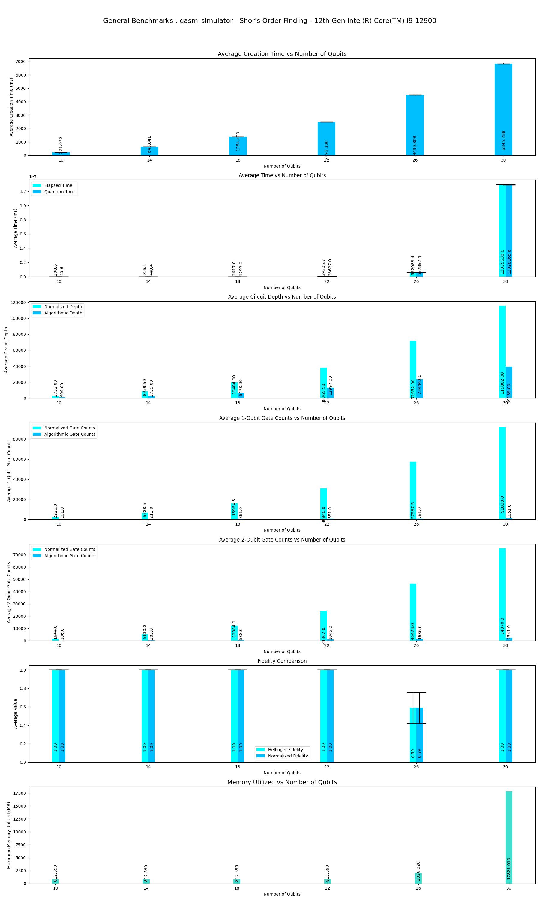|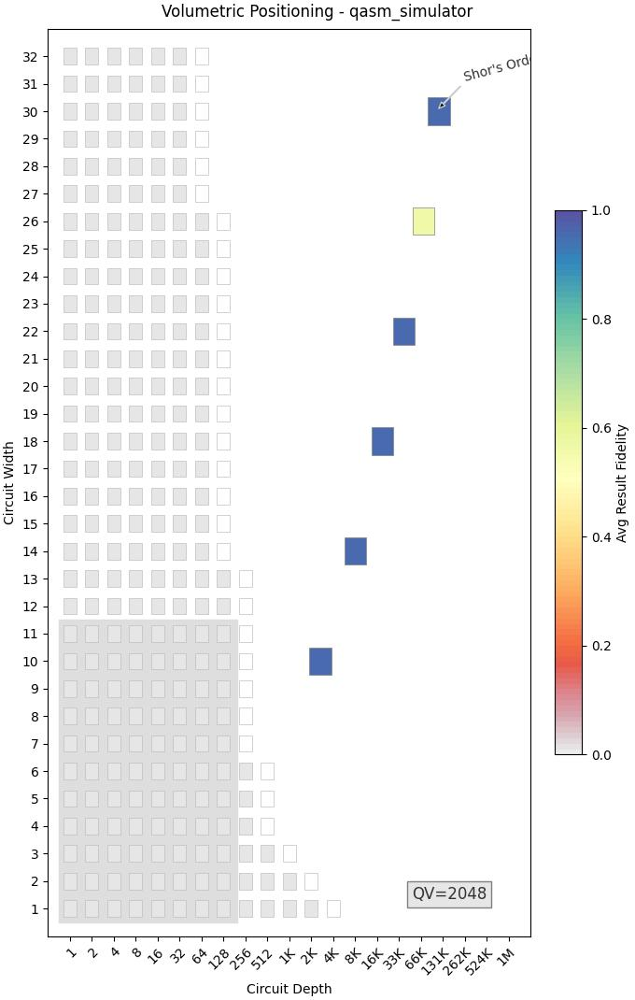|Qasm simulator supports upto **31** qubits. Execution is terminated upto **30** qubits because of skip qubits parameter. |
|qasm_simulator **method-1**|min_qubits=10, max_qubits=22, max_circuits=2, num_shots=1000,basis: 1-['rx', 'ry', 'rz', 'cx']|depol_one_qb_error = 0.05, depol_two_qb_error = 0.005, reset_to_zero_error = 0.005, reset_to_one_error = 0.005|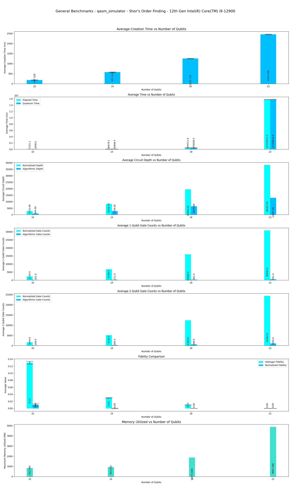|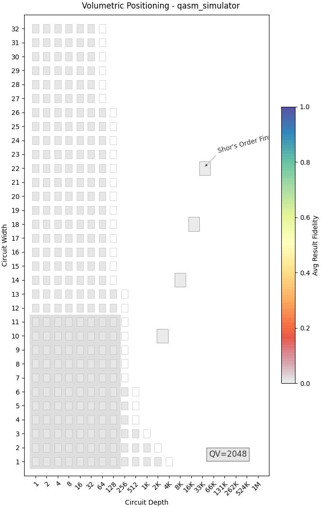|Execution is terminated at **22** Qubits because of longer execution periods.|
|statevector_simulator **method-1**|min_qubits=10, max_qubits=22, skip_qubits=1, max_circuits=1, num_shots=1000,basis: 1-['rx', 'ry', 'rz', 'cx']|depol_one_qb_error = 0.05, depol_two_qb_error = 0.005, reset_to_zero_error = 0.005, reset_to_one_error = 0.005|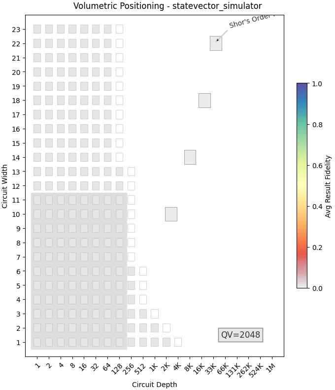|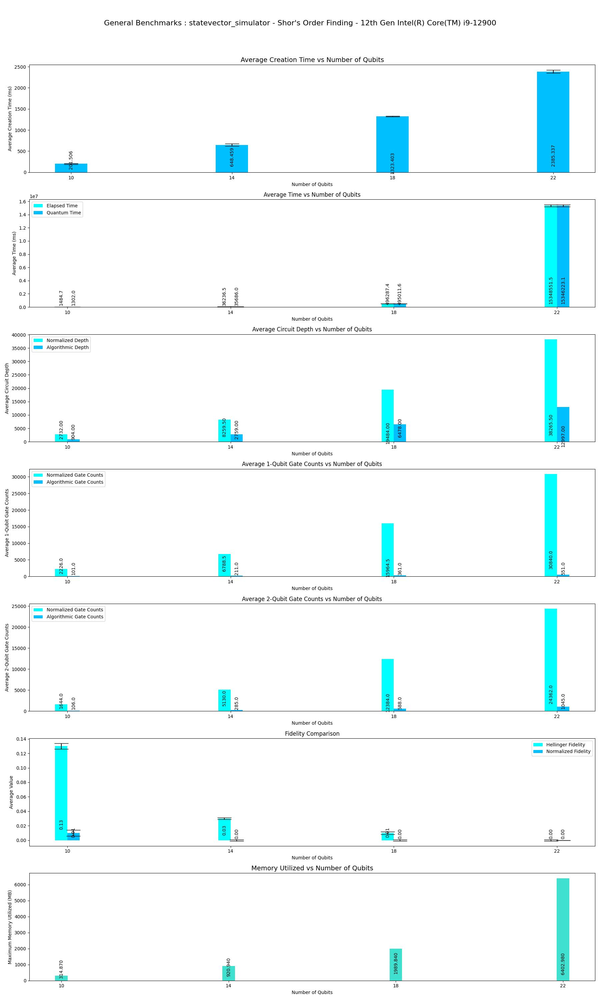|Execution is terminated at **22** Qubits because of longer execution periods.|
|statevector_simulator **method-1**|min_qubits=10, max_qubits=22, max_circuits=2, num_shots=1000,basis: 1-['rx', 'ry', 'rz', 'cx']|***ideal***|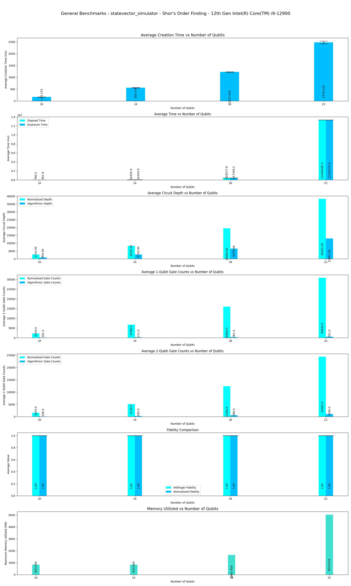|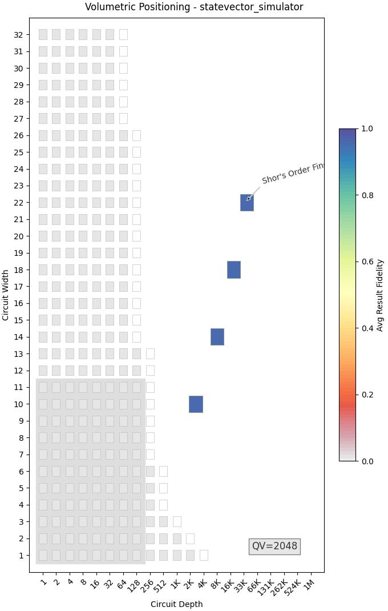|Execution is terminated at **22** Qubits because of longer execution periods.|
|ibmq_guadalupe (1.2.15) **FAKE** **method-1**|min_qubits=10, max_qubits=16(provider's preset), max_circuits=2, num_shots=1000, basis: (default-Provider)|***Provider Preset***|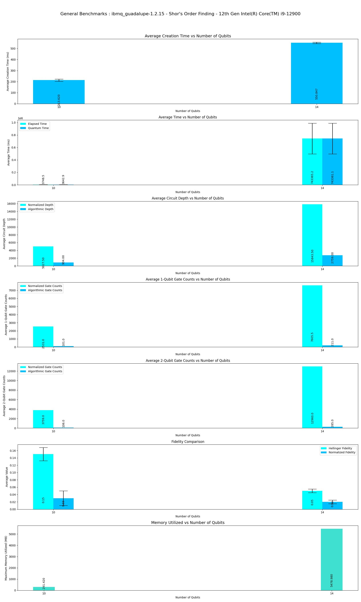|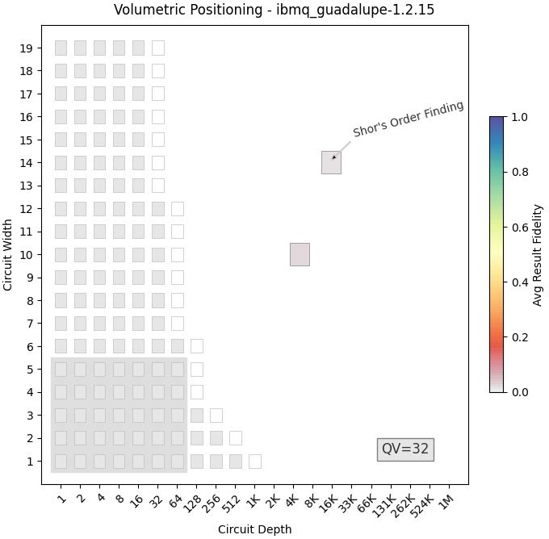|This is Fake Backend with maximum supported qubits **16**|
|ibmq_guadalupe (1.2.15) **FAKEV2** **method-1**|min_qubits=10, max_qubits=16(provider's preset), max_circuits=2, num_shots=1000, basis: (default-Provider)|***Provider Preset***|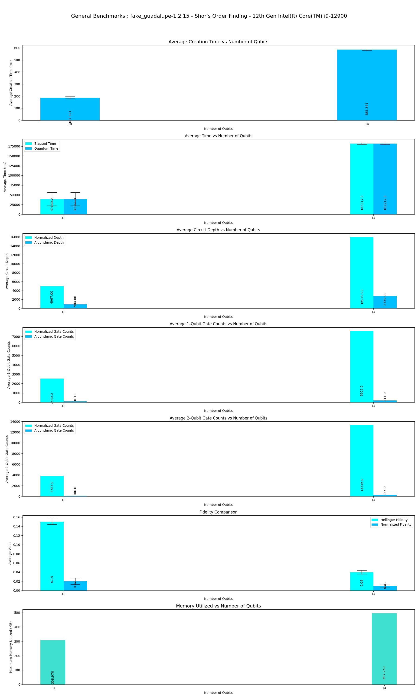||This is Fake Backend with maximum supported qubits **16**|
|qasm_simulator **method-2**|min_qubits=7, max_qubits=17, max_circuits=2, num_shots=1000, basis: 1-['rx', 'ry', 'rz', 'cx']|***ideal***|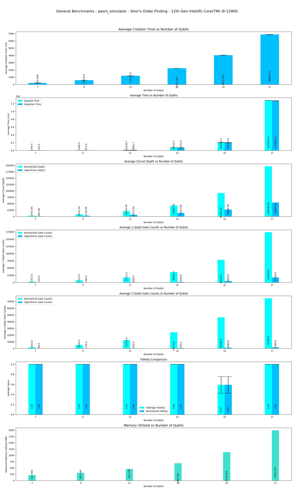|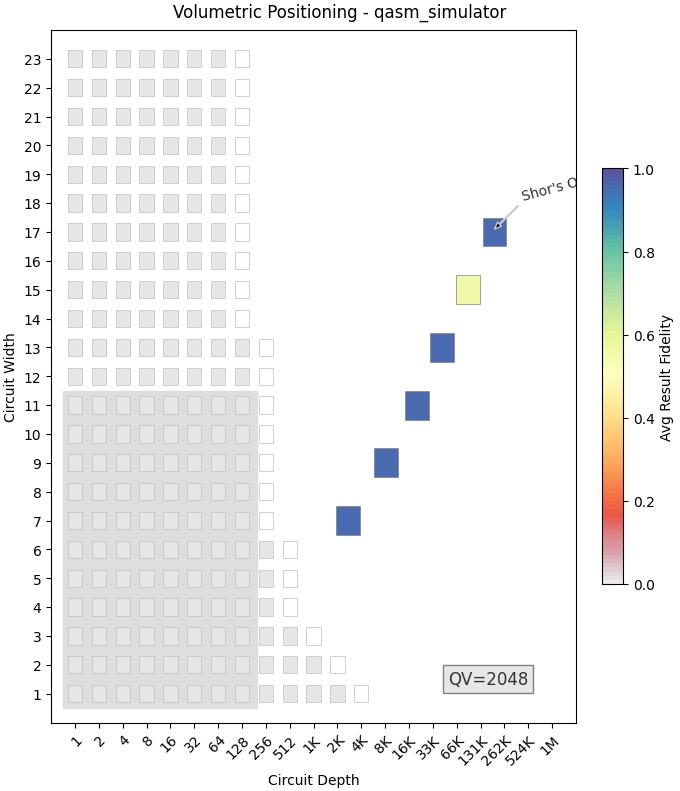|Qasm simulator supports upto **31** qubits. Execution is terminated upto **17** qubits because of OverflowError: (34, 'Numerical result out of range') at 19 Qubits.|
|qasm_simulator **method-2**|min_qubits=7, max_qubits=17, max_circuits=2, num_shots=1000, basis: 1-['rx', 'ry', 'rz', 'cx']|depol_one_qb_error = 0.05, depol_two_qb_error = 0.005, reset_to_zero_error = 0.005, reset_to_one_error = 0.005||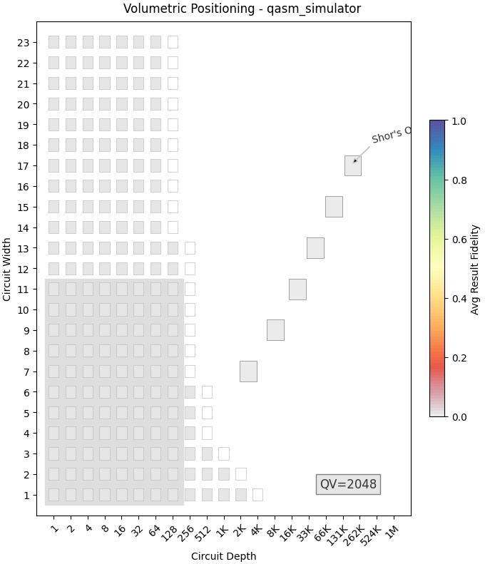|Qasm simulator supports upto **31** qubits. Execution is terminated upto **17** qubits because of OverflowError: (34, 'Numerical result out of range') at 19 Qubits.|
|statevector_simulator **method-2**|min_qubits=7, max_qubits=17, max_circuits=2, num_shots=1000, basis: 1-['rx', 'ry', 'rz', 'cx']|***ideal***|||Statevector simulator supports upto **31** qubits. Execution is terminated upto **17** qubits because of OverflowError: (34, 'Numerical result out of range') at 19 Qubits.|