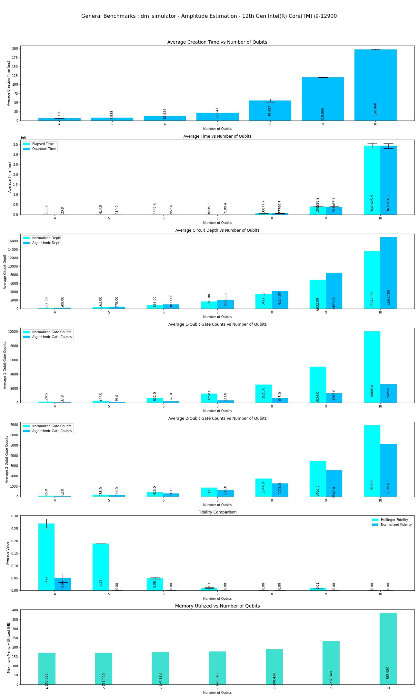
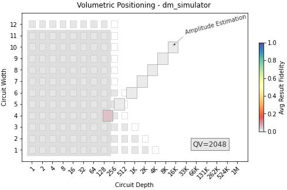

This program performs Benchmarks of **Amplitude Estimation** Algorithm on QSim's Density matrix simulator.

|Platform|Parameters|Noise Parameters|Benchmarks|Volumetric Positioning|Remarks|
|--------|----------|----------------|----------|----------------------|-------|
|dm_simulator|min_qubits=4, max_qubits=10, skip_qubits=1, max_circuits=2, num_shots=1000, basis: 1-['rx', 'ry', 'rz', 'cx']|***ideal***|***TBD***|***TBD***|Execution is performed only upto **10** qubits due to longer execution times.|
|dm_simulator|min_qubits=4, max_qubits=10, skip_qubits=1, max_circuits=2, num_shots=1000,basis: 1-['rx', 'ry', 'rz', 'cx']|options_noisy = {"thermal_factor": 0.9,'show_partition': False,"decoherence_factor": 0.9,"depolarization_factor": 0.9,"bell_depolarization_factor": 1,"decay_factor": 0.75,"rotation_error": {'rx':[1.0, 0.0], 'ry':[1.0, 0.0], 'rz':[1.0, 0.0]},"tsp_model_error": [1.0, 0.0]}|||Longer execution period after **10** Qubits.|