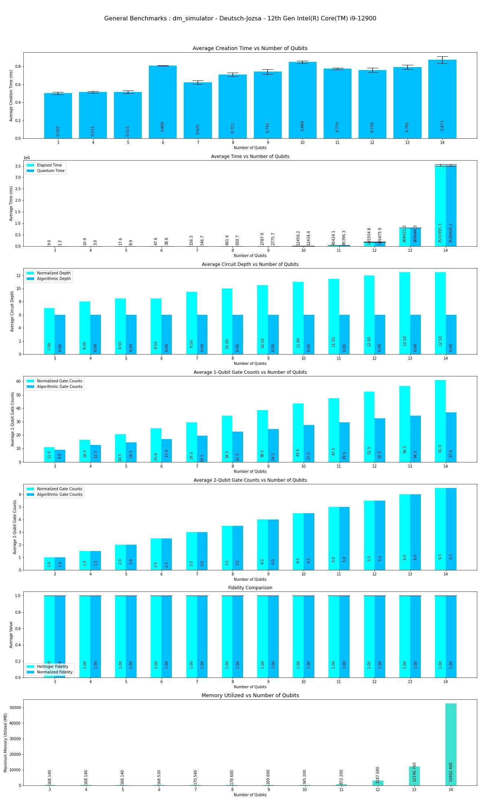
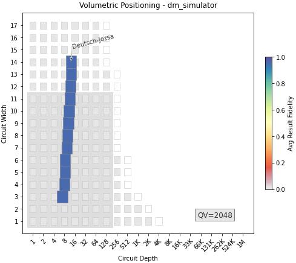

This program performs Benchmarks of **Deutsch-Jozsa** Algorithm on density matrix simulator **QSim**.

|Platform|Parameters|Noise Parameters|Benchmarks|Volumetric Positioning|Remarks|
|--------|----------|----------------|----------|----------------------|-------|
|dm_simulator |min_qubits=3, max_qubits=14, skip_qubits=1, max_circuits=2, num_shots=1000, basis: 1-['rx', 'ry', 'rz', 'cx']|***ideal***|||dm_simulator supports upto **31** qubits, due to resource constraints like memory and time constriants, execution is limited upto **14** qubits.|
|dm_simulator |min_qubits=3, max_qubits=14, skip_qubits=1, max_circuits=2, num_shots=1000, basis: 1-['rx', 'ry', 'rz', 'cx']|options_noisy = {"thermal_factor": 0.9, "decoherence_factor": 0.9,"depolarization_factor": 0.9,"bell_depolarization_factor": 1,"decay_factor": 0.75,"rotation_error": {'rx':[1.0, 0.0], 'ry':[1.0, 0.0], 'rz':[1.0, 0.0]},"tsp_model_error": [1.0, 0.0],}|||There is no major differences between noisy and noiseless executions w.r.t execution times and memory consumption.|
