This program performs Benchmarks of **QFT** Algorithm on QSim's Density matrix simulator.

|Platform|Parameters|Noise Parameters|Benchmarks|Volumetric Positioning|Remarks|
|--------|----------|----------------|----------|----------------------|-------|
|dm_simulator|min_qubits=2, max_qubits=13, skip_qubits=1, max_circuits=3, num_shots=1000, basis: 1-['rx', 'ry', 'rz', 'cx'], method = 1|***ideal***|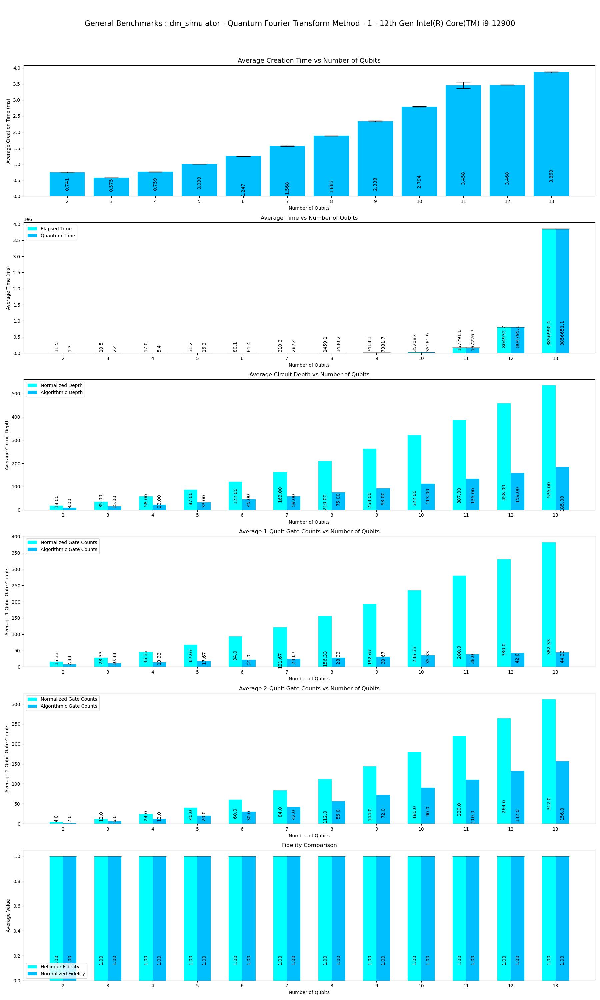|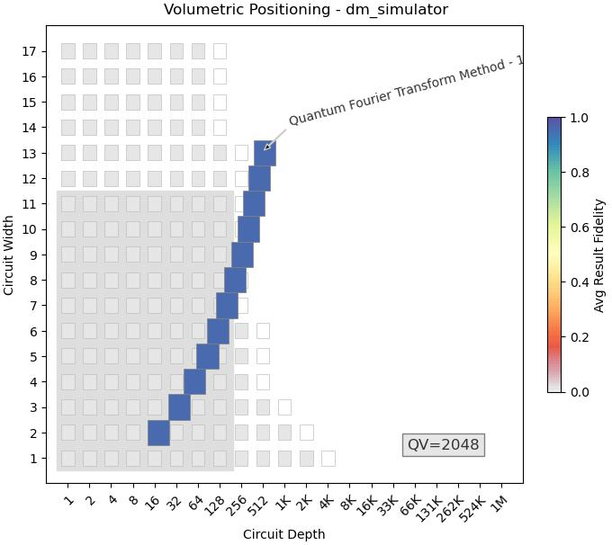||
|dm_simulator|min_qubits=2, max_qubits=13, skip_qubits=1, max_circuits=3, num_shots=1000,basis: 1-['rx', 'ry', 'rz', 'cx'], method = 1|options_noisy = {"thermal_factor": 0.9,'show_partition': False,"decoherence_factor": 0.9,"depolarization_factor": 0.9,"bell_depolarization_factor": 1,"decay_factor": 0.75,"rotation_error": {'rx':[1.0, 0.0], 'ry':[1.0, 0.0], 'rz':[1.0, 0.0]},"tsp_model_error": [1.0, 0.0]}|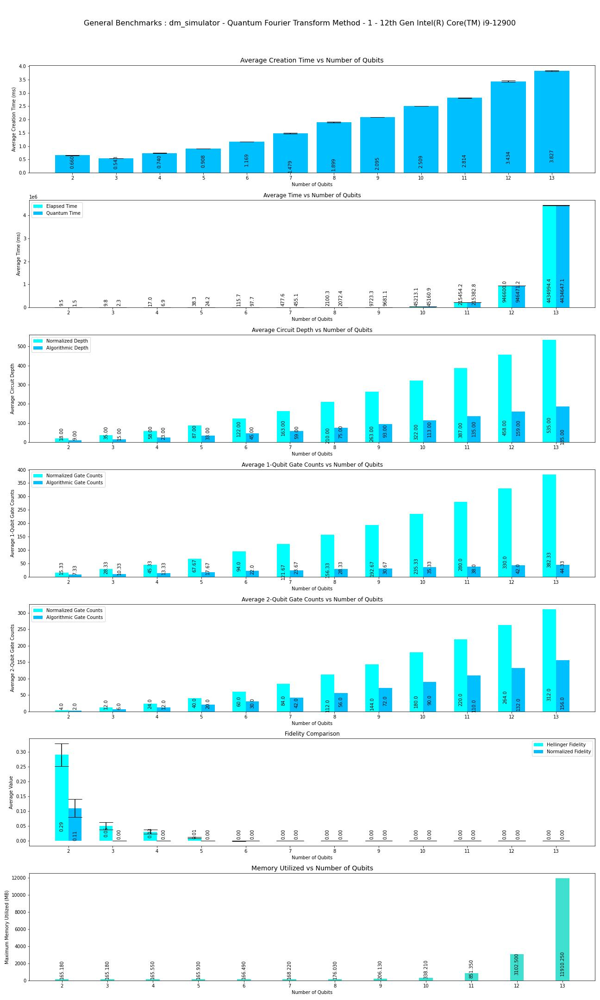|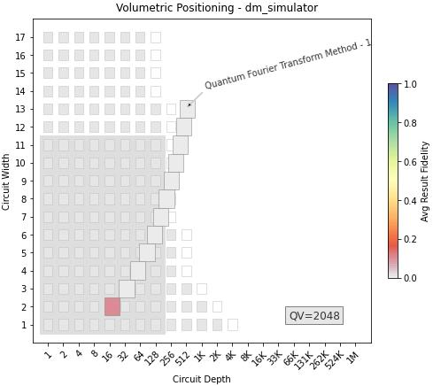||
|dm_simulator|min_qubits=2, max_qubits=14, skip_qubits=1, max_circuits=3, num_shots=1000, basis: 1-['rx', 'ry', 'rz', 'cx'], method = 2|***ideal***|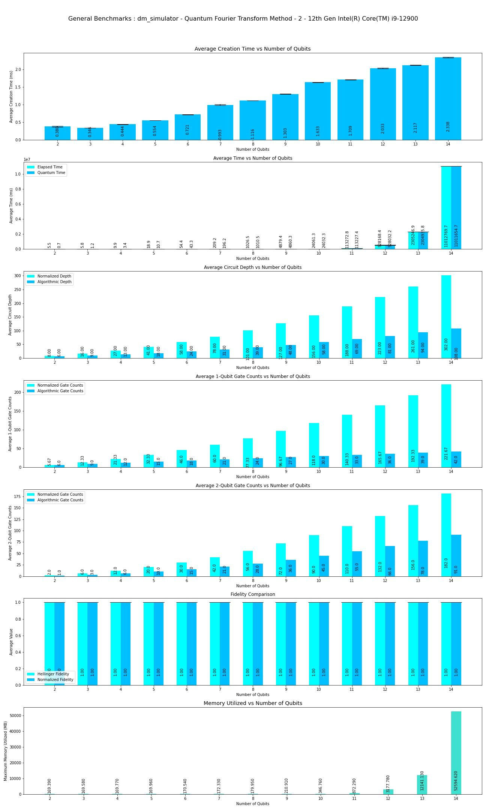|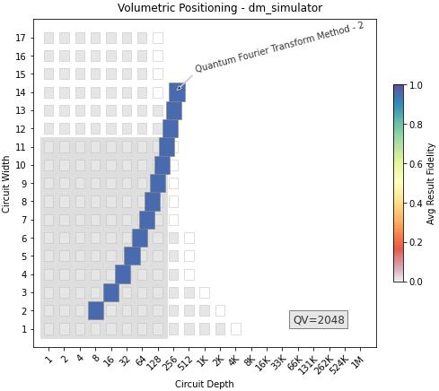|Execution is performed only upto **14** qubits due to longer execution times.|
|dm_simulator|min_qubits=2, max_qubits=14, skip_qubits=1, max_circuits=3, num_shots=1000,basis: 1-['rx', 'ry', 'rz', 'cx'], method = 2|options_noisy = {"thermal_factor": 0.9,'show_partition': False,"decoherence_factor": 0.9,"depolarization_factor": 0.9,"bell_depolarization_factor": 1,"decay_factor": 0.75,"rotation_error": {'rx':[1.0, 0.0], 'ry':[1.0, 0.0], 'rz':[1.0, 0.0]},"tsp_model_error": [1.0, 0.0]}|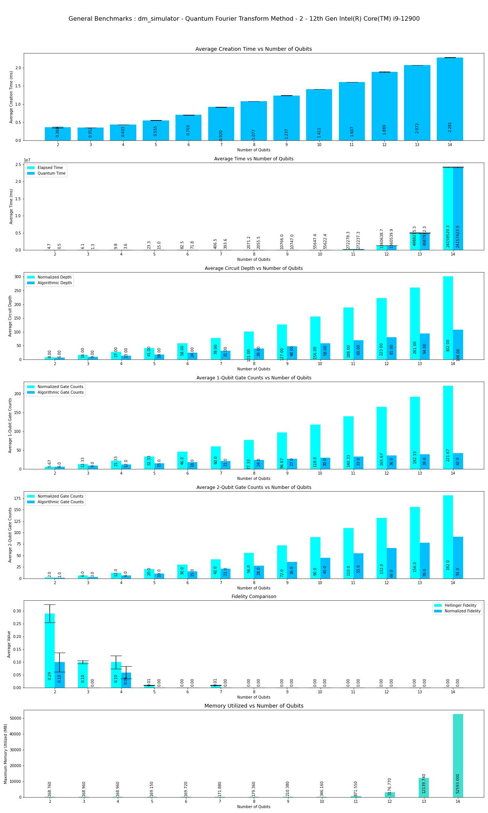|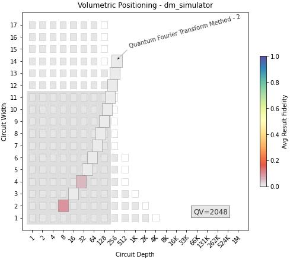|Execution is performed only upto **14** qubits due to longer execution times.|
|dm_simulator|min_qubits=2, max_qubits=13, skip_qubits=1, max_circuits=3, num_shots=1000, basis: 1-['rx', 'ry', 'rz', 'cx'], method = 3|***ideal***|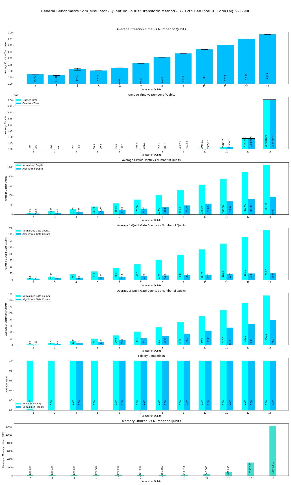|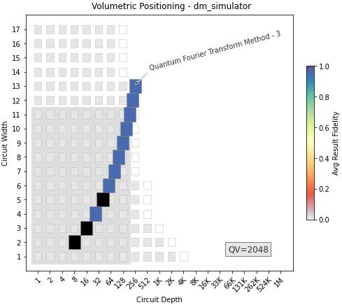|Execution is performed only upto **13** qubits due to longer execution times.|
|dm_simulator|min_qubits=2, max_qubits=13, skip_qubits=1, max_circuits=3, num_shots=1000,basis: 1-['rx', 'ry', 'rz', 'cx'], method = 3|options_noisy = {"thermal_factor": 0.9,'show_partition': False,"decoherence_factor": 0.9,"depolarization_factor": 0.9,"bell_depolarization_factor": 1,"decay_factor": 0.75,"rotation_error": {'rx':[1.0, 0.0], 'ry':[1.0, 0.0], 'rz':[1.0, 0.0]},"tsp_model_error": [1.0, 0.0]}|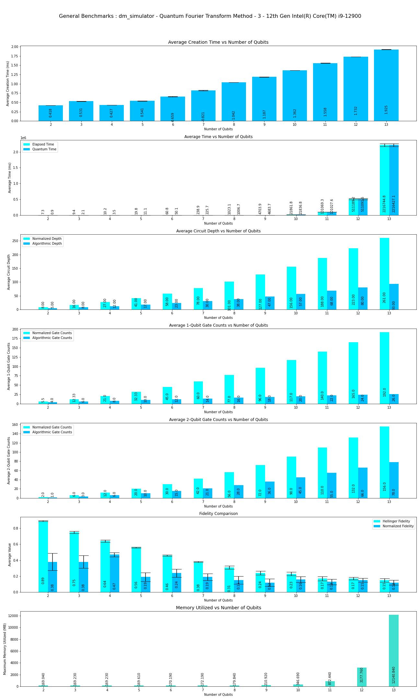|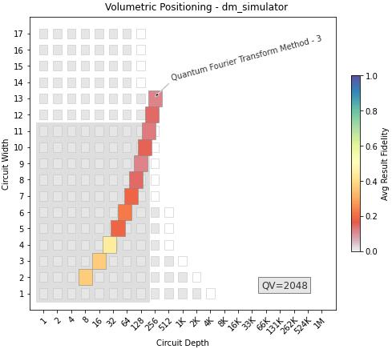|Execution is performed only upto **13** qubits due to longer execution times.|